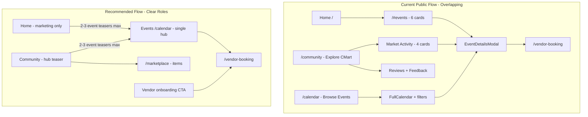

# CMart Ecosystem Frontend UX / IA Audit Report

**Scope:** Public and community-facing routes only. No code changes proposed in this document — recommendations are for a follow-up implementation pass.

---

## Executive Summary

The CMart frontend has a **single flat router** ([`frontend/src/router/router.js`](frontend/src/router/router.js)) and one shared navbar ([`frontend/src/components/navigation/AppNavbar.vue`](frontend/src/components/navigation/AppNavbar.vue)) driven by [`frontend/src/config/navigation.js`](frontend/src/config/navigation.js). Public discovery is split across **four overlapping entry points** for events:

1. **Home** (`/`) — `/#events` section with up to 6 event cards
2. **Explore CMart / Community** (`/community`) — hero + 4 event cards in “Market Activity”
3. **Browse Events / Calendar** (`/calendar`) — full interactive calendar
4. **Footer** — both “Events” (`/#events`) and “Event Calendar” (`/calendar`)

**Explore CMart** (`/community`) is structurally a community hub (reviews, feedback, marketplace teaser, vendor CTA) but **reads like an events page** because its hero promotes “View Event Calendar,” the mid-page event block uses event-first labels (“Upcoming Events / Market Activity”), and event cards include booking CTAs identical to Home and Calendar.

**Critical navigation bug:** Authenticated community users cannot reach Home hash sections. Route meta `redirectIfAuthenticated: true` on `/` redirects them to `/community` before `/#events` or `/#vendor` can load. This makes the **“Events” nav item** (`/#events`) and **“Become a Vendor” navbar CTA** (`/#vendor` via `bookingPathForUser()`) ineffective for logged-in community visitors.

**Recommended direction:** Clarify four distinct jobs — **Home** (marketing), **Community** (engage/reviews/marketplace teaser), **Events/Calendar** (single event hub), **Carboot Preview** (item discovery), **Become a Vendor** (onboarding) — and consolidate event browsing to `/calendar` while demoting event content on `/community` to a small teaser.



---

## Current Route Map

| Path | Route name | Component | Main purpose | Access |
|------|------------|-----------|--------------|--------|
| `/` | `home` | [`PublicLanding.vue`](frontend/src/views/public/PublicLanding.vue) | Marketing landing: hero, events section, why visit, vendor pitch, news | **Public**; authenticated users **redirected away** to role home |
| `/#events` | *(hash on home)* | `PublicLanding.vue` | “Upcoming Carboot Events” — 6 event cards + calendar CTA | Public (guests only in practice — auth users redirected) |
| `/#vendor` | *(hash on home)* | `PublicLanding.vue` | “Become a Carboot Vendor” benefits + Book a Space | Public (guests only in practice) |
| `/#news` | *(hash on home)* | `PublicLanding.vue` | News & Updates feed | Public (guests only in practice) |
| `/community` | `community` | [`CommunityPortal.vue`](frontend/src/views/public/CommunityPortal.vue) | Community hub: feature cards, event teaser, reviews, vendor CTA | **Public** |
| `/community#share-feedback` | *(hash)* | `CommunityPortal.vue` | Review submission form anchor | Public |
| `/community#become-vendor` | *(hash)* | `CommunityPortal.vue` | “Ready to become a vendor?” section | Public |
| `/marketplace` | `marketplace` | [`ReuseMarketplace.vue`](frontend/src/views/public/ReuseMarketplace.vue) | Carboot Reuse Preview — browse vendor items, in-person only | **Public** |
| `/calendar` | `calendar` | [`EventCalendar.vue`](frontend/src/components/EventCalendar.vue) | Full event calendar, filters, stats, booking links | **Public** |
| `/register` | `register` | [`Register.vue`](frontend/src/views/auth/Register.vue) | Create community account | **Guest only** |
| `/login` | `login` | [`PublicLogin.vue`](frontend/src/views/auth/PublicLogin.vue) | Sign in (supports `?redirect=`) | **Guest only** |
| `/vendor-booking` | `vendor-booking` | [`Registration.vue`](frontend/src/views/auth/Registration.vue) | Book vendor booth for an event | **Authenticated + community role + approved vendor** |
| `/vendor-booking?event_id={id}` | `vendor-booking` | `Registration.vue` | Pre-selected event booking | Same as above |
| `/dashboard` | `vendor-dashboard` | [`VendorDashboard.vue`](frontend/src/views/dashboards/VendorDashboard.vue) | Vendor hub after first activity | **Vendor user** (community + vendor activity) |
| `/profile` | `vendor-profile` | [`VendorProfile.vue`](frontend/src/views/vendor/VendorProfile.vue) | Business profile | **Vendor user** |
| `/staff/verify-booking/:id` | `staff-verify-booking` | [`StaffVerifyBooking.vue`](frontend/src/views/staff/StaffVerifyBooking.vue) | On-site booking verification | **Staff+** |
| `/admin#events` | `admin` | `StaffEventsPanel.vue` (in AdminDashboard) | Staff event CRUD | **Staff+** |
| `/admin#bookings` | `admin` | `StaffBookingsPanel.vue` | Staff booking approval | **Staff+** |

**Notes:**
- No standalone `BrowseEvents.vue` or `Events.vue` — those are **nav labels**, not routes.
- `Registration.vue` is **booth booking**, not account signup (`Register.vue`).
- All routes are **statically imported** (no lazy loading).

---

## Current Navigation Map

**Source files:** [`navigation.js`](frontend/src/config/navigation.js), [`AppNavbar.vue`](frontend/src/components/navigation/AppNavbar.vue), [`SiteFooter.vue`](frontend/src/components/layout/SiteFooter.vue)

### Nav link sets by auth state

| Auth state | Nav items | Paths |
|------------|-----------|-------|
| **Guest / non-community** | Home, Community, Carboot Preview, Events, Vendor Info, News & Updates | `/`, `/community`, `/marketplace`, `/#events`, `/#vendor`, `/#news` |
| **Community visitor** (logged in, no vendor activity) | Explore CMart, Carboot Preview, Browse Events, Events | `/community`, `/marketplace`, `/calendar`, `/#events` |
| **Vendor** | Vendor Dashboard, Carboot Preview, Community, Calendar, Business Profile | `/dashboard`, `/marketplace`, `/community`, `/calendar`, `/profile` |

### Extra navbar elements (not in `navLinks`)

| Label | Target | When shown |
|-------|--------|------------|
| Logo | `auth.homeForUser()` or `/` | Always |
| **Become a Vendor** / **Book a Space** | `auth.bookingPathForUser()` | `variant === 'public'` |
| Sign in / Logout | `/login` or logout action | By auth state |

`bookingPathForUser()` ([`auth.js`](frontend/src/stores/auth.js) L170–174):
- Approved vendor → `/vendor-booking`
- Authenticated, not approved → `/#vendor` (**broken for community users** — see Confusion Points)
- Guest → `/login?redirect=/vendor-booking`

### Active state logic

Custom `isActive(link)` in `AppNavbar.vue` (desktop only; **mobile has no active styling**):

```203:211:frontend/src/components/navigation/AppNavbar.vue
const isActive = (link) => {
  if (link.hash) {
    return route.path === '/' && route.hash === link.hash;
  }
  if (link.exact) {
    return route.path === link.to && !route.hash;
  }
  return route.path === link.to || route.path.startsWith(`${link.to}/`);
};
```

- Hash links active only on `/` + matching hash.
- `exact: true` links require exact path, no hash.
- Non-exact `/community` (public “Community”) also matches child paths if any existed.

### Can two items appear active?

**Generally no** — mutually exclusive path/hash rules prevent double-active on desktop. Edge case: on `/community`, only “Explore CMart” (exact) or “Community” (prefix) highlights; not both sets at once.

**Confusion without double-active:** “Browse Events” (`/calendar`) and “Events” (`/#events`) are **different routes with similar intent** — user may not know which to click. Footer adds a third: “Event Calendar” → `/calendar` alongside “Events” → `/#events`.

### Footer links

`PUBLIC_LINKS` minus Home, plus hardcoded **Event Calendar** → `/calendar` and Sign in → `/login`. Duplicates calendar entry point.

---

## Explore CMart Current Content

**File:** [`CommunityPortal.vue`](frontend/src/views/public/CommunityPortal.vue) — route `/community`, nav label “Explore CMart” (community visitors) or “Community” (guests/vendors).

### Hero (L5–32)
- Eyebrow: “Carboot@CMart Community”
- Title: **“Explore Our Community”**
- Subtitle: discover vendors, share experience, stay connected
- CTAs:
  - **Join the Community** → `/register` (guests only)
  - **View Event Calendar** → `/calendar` (always visible — **event-first secondary CTA in community hero**)

### Feature cards (L35–66) — static, 3 columns
1. **Vibrant Community** — community copy only
2. **Vendor Marketplace** — link to `/marketplace` (“Browse Reuse Marketplace →”)
3. **Community Reviews** — points to reviews section below

### Event section — “Market Activity” (L68–123)
- Eyebrow: **“Upcoming Events”**; title: **“Market Activity”**
- Header link: “Full Calendar →” `/calendar`
- Data: `GET /events` — shows **first 4** cards (no upcoming-date filter in fetch; unlike landing which slices to 6)
- Each card: click opens `EventDetailsModal`; per-card CTA “Book” or “Learn More” via `vendorBookingLink()`

**What makes this feel like an Events page:**
- Hero CTA “View Event Calendar” competes with community CTAs
- Section labeled “Upcoming Events” with full event card grid + booking buttons
- Same `EventDetailsModal` + booking pattern as Home and Calendar
- No equivalent-sized community-only block above events — events appear **before** the large reviews section

### Reviews / community (L125–358) — largest unique section
- **Share Your Voice** — `CommunityFeedback` component, anchor `#share-feedback`
- **Community Reviews** — paginated `GET /feedbacks`, filters, summary stats, photo lightbox

### Vendor CTA (L360–403) — `#become-vendor`
- “Ready to become a vendor?” with Become a Vendor / Create Account / review CTAs
- Hidden for `auth.isVendorUser`

### Not present on this page
- Embedded FullCalendar
- News & Updates (only on Home)
- “Why Visit” marketing content (only on Home)

---

## Events Flow Current Content

### 1. Home — `/#events` ([`PublicLanding.vue`](frontend/src/views/public/PublicLanding.vue))
| Capability | Status |
|------------|--------|
| Browse events | Yes — up to **6** cards from `GET /events` |
| View calendar | Link only — “View Full Calendar” → `/calendar` |
| Book/register | Via `vendorBookingLink()` on cards + hero “Book a Vendor Space” |
| Unique content | Richest event cards (description, location, animations); also has vendor + news sections |

Hero primary CTA: **“View Upcoming Events”** → `/#events`

### 2. Explore CMart — `/community` ([`CommunityPortal.vue`](frontend/src/views/public/CommunityPortal.vue))
| Capability | Status |
|------------|--------|
| Browse events | Yes — **4** cards (teaser scale) |
| View calendar | Hero + section header links → `/calendar` |
| Book/register | Per-card + modal booking links |
| Unique content | Reviews, feedback form (primary differentiator) |

### 3. Event Calendar — `/calendar` ([`EventCalendar.vue`](frontend/src/components/EventCalendar.vue))
| Capability | Status |
|------------|--------|
| Browse events | Yes — FullCalendar month view, filter chips, month stats |
| View calendar | **Primary purpose** |
| Book/register | `EventDetailsModal` → `vendorBookingLink()` |
| Nav labels | “Browse Events” (community visitor), “Calendar” (vendor), footer “Event Calendar” |
| Staff extras | Date-range drag to create events (`POST /carboot-events`) |

Page title: **“CMart Carboot Schedule”** — clearest event-discovery page.

### 4. Vendor booking — `/vendor-booking` ([`Registration.vue`](frontend/src/views/auth/Registration.vue))
| Capability | Status |
|------------|--------|
| Browse events | Event dropdown from `GET /events` |
| View calendar | No |
| Book/register | **Yes** — full booth booking form → `POST /bookings` |
| Access | Approved vendors only; others redirected |

### 5. Account signup — `/register` ([`Register.vue`](frontend/src/views/auth/Register.vue))
Account creation only; supports redirect back to community actions.

### Duplicate event content

All three public surfaces share:
- `GET /events`
- `mapApiEventToCard()` from [`eventDisplay.js`](frontend/src/utils/eventDisplay.js)
- `EventDetailsModal`
- `vendorBookingLink()`

**Duplication severity:** High between Home and Community; Calendar is the canonical full browse experience but is not positioned as the **only** events hub in nav or copy.

---

## Confusion Points

1. **Explore CMart vs Events — unclear split**
   - Both show event card grids with booking CTAs.
   - Community hero pushes calendar; Events nav goes to a different page’s section.
   - Authenticated users’ default home is `/community`, so they live on Explore CMart but nav still offers “Events” pointing elsewhere.

2. **“Browse Events” vs “Events” vs “Event Calendar” — three labels, two destinations**
   - Browse Events → `/calendar`
   - Events → `/#events` (Home section)
   - Footer Event Calendar → `/calendar` (duplicate of Browse Events)

3. **Broken nav for authenticated community visitors**
   - `/` has `redirectIfAuthenticated: true` → community users sent to `/community`
   - Clicking **Events** (`/#events`) or **Vendor Info** (`/#vendor`) never reaches Home hashes
   - `bookingPathForUser()` returns `/#vendor` for authenticated non-approved vendors — same redirect trap
   - Intended fallback exists: `/community#become-vendor` ([`postAuthRedirect.js`](frontend/src/utils/postAuthRedirect.js)) but is not used by navbar CTA

4. **Overlapping CTAs**
   - “View Event Calendar” in Community hero + “Full Calendar” in section + nav “Browse Events”
   - “Become a Vendor” in navbar, Community `#become-vendor`, and Home `/#vendor` — three onboarding entry points with inconsistent targets

5. **Event calendar in wrong mental model**
   - Community landing promotes full calendar in hero; users expecting community content get event scheduling first.

6. **Visitor → vendor booking journey gaps**
   - Guest: Home/Community card → login redirect → must become approved vendor before `/vendor-booking`
   - No clear “apply to become vendor” route — only hash sections and login funnel
   - `Registration.vue` filename suggests account registration

7. **Calendar back link label mismatch**
   - `backLabel` = “Back to Dashboard” for all authenticated users, but community visitors go to `/community` ([`EventCalendar.vue`](frontend/src/components/EventCalendar.vue) L268–269)

8. **Mobile nav lacks active state** — harder to know current section on small screens.

9. **Community vs Explore CMart naming** — same route `/community`, different labels by auth state.

---

## Recommended New Flow

### A. Explore CMart (`/community`) — Community landing
**Job:** What CMart is, community value, social proof, light discovery.

**Should include:**
- Community hero (keep “Explore Our Community” or rename to “Community Hub”)
- 3 feature cards (community, marketplace preview, reviews)
- **2–3 upcoming event teasers** (title, date, “See all events →” only — no per-card Book on landing)
- Full reviews + feedback (keep as anchor content)
- Vendor onboarding CTA → `/community#become-vendor`

**Should remove/demote:**
- Hero “View Event Calendar” as equal CTA → move to text link or single line under teasers
- “Market Activity” as large event grid → compact teaser row
- Per-event booking buttons on community landing (reserve for Events page / modal from Events only)

### B. Carboot Preview (`/marketplace`) — Item discovery
**Job:** Browse reuse items; in-person purchase only.

**Keep as-is** — already well-scoped with “Before you visit” notice. Optional: add small link “Check event dates → /calendar” in plan-your-visit section.

### C. Events (`/calendar`) — Single event hub
**Job:** All event discovery, calendar, details, booking entry.

**Consolidate:**
- Rename nav **“Browse Events”** and footer **“Event Calendar”** to one label: **“Events”** → `/calendar`
- Remove or repoint Home `/#events` nav item for authenticated users
- Home keeps a **small teaser** (2–3 cards) for guests with “View all events → /calendar”

### D. Browse Events / Book a Booth — Merge decision
**Recommendation: Merge into Events (`/calendar`).**

| Current | Recommended |
|---------|-------------|
| Browse Events → `/calendar` | **Events** → `/calendar` |
| Events → `/#events` | Remove from community nav; keep Home teaser for guests only |
| Book a Booth | Stays on event detail modal + `/vendor-booking` — not a top-level nav item |

If “Book a Booth” must remain visible for vendors, keep navbar **“Book a Space”** CTA (already exists for vendor users).

### E. Become a Vendor — Onboarding CTA
**Job:** Explain benefits, route to account + application.

**Single canonical target for authenticated community visitors:** `/community#become-vendor` (not `/#vendor`).

**Guest path:** `/login?redirect=/community%23become-vendor` or register with same redirect.

---

## File-by-File Improvement Plan

| File | Current issue | Recommended change | Why | Risk |
|------|---------------|------------------|-----|------|
| [`navigation.js`](frontend/src/config/navigation.js) | Community nav has both “Browse Events” and “Events” | Remove `Events` → `/#events` from `COMMUNITY_VISITOR_LINKS`; rename “Browse Events” → **“Events”** → `/calendar` | One event entry for logged-in users | **Low** |
| [`navigation.js`](frontend/src/config/navigation.js) | Public nav “Events” → `/#events` vs footer “Event Calendar” | Public: keep Home `/#events` OR change to `/calendar`; align footer to same target | Eliminate duplicate calendar links | **Medium** (guest behavior change) |
| [`auth.js`](frontend/src/stores/auth.js) | `bookingPathForUser()` → `/#vendor` breaks for auth community users | Return `/community#become-vendor` for authenticated non-approved community users | CTA reaches real onboarding section | **Low** |
| [`CommunityPortal.vue`](frontend/src/views/public/CommunityPortal.vue) | Hero “View Event Calendar” competes with community message | Demote to text link under hero or remove; primary guest CTA = Join Community | Clear community-first hierarchy | **Low** |
| [`CommunityPortal.vue`](frontend/src/views/public/CommunityPortal.vue) | “Market Activity” shows 4 full cards + Book CTAs | Reduce to 2–3 compact teasers; replace “Book/Learn More” with single “View event →” linking to `/calendar` or modal without booking CTA | Stops community page feeling like Events | **Medium** |
| [`CommunityPortal.vue`](frontend/src/views/public/CommunityPortal.vue) | Section title “Upcoming Events / Market Activity” | Rename to **“Happening Soon”** or **“Next Market Dates”** with subcopy “Plan your visit” | Softer event framing | **Low** |
| [`PublicLanding.vue`](frontend/src/views/public/PublicLanding.vue) | 6-card event grid duplicates calendar | Keep for guests but reduce to 3 cards; strengthen “View all events” → `/calendar` | Home = marketing, not full browse | **Medium** |
| [`EventCalendar.vue`](frontend/src/components/EventCalendar.vue) | `backLabel` “Back to Dashboard” for all auth users | Dynamic label: “Back to Community” vs “Back to Dashboard” based on `isVendorUser` | Accurate wayfinding | **Low** |
| [`AppNavbar.vue`](frontend/src/components/navigation/AppNavbar.vue) | Mobile nav lacks `isActive` | Apply same `isActive` classes to mobile links | Consistent orientation | **Low** |
| [`SiteFooter.vue`](frontend/src/components/layout/SiteFooter.vue) | Hardcoded “Event Calendar” duplicates Events | Remove extra link if `PUBLIC_LINKS` Events points to `/calendar`; or rename consistently | Footer clarity | **Low** |
| [`router.js`](frontend/src/router/router.js) | `redirectIfAuthenticated` blocks hash access to Home sections | Allow hash navigation to `/#events`, `/#vendor`, `/#news` when `to.hash` is set, OR move those sections’ nav targets to `/calendar` and `/community#become-vendor` only | Fixes broken authenticated links | **Medium** (guard logic) |
| [`Registration.vue`](frontend/src/views/auth/Registration.vue) | Filename implies account registration | No route rename; optional UI subtitle clarity “Vendor booth booking” (already present) | Reduces dev confusion only | **Low** |

---

## Suggested Copy Changes

| Location | Current | Suggested |
|----------|---------|-----------|
| Community nav | Explore CMart | **Community** (consistent across auth states) OR keep Explore CMart with subtitle “Reviews, vendors & highlights” |
| Community visitor nav | Browse Events | **Events** |
| Community hero secondary CTA | View Event Calendar | **See upcoming dates** (text link, not button) OR remove |
| Community event section eyebrow | Upcoming Events | **Happening Soon** |
| Community event section title | Market Activity | **Next market dates** |
| Community event teaser CTA | Book / Learn More | **View details** (links to `/calendar` or modal without booking) |
| Event calendar page H1 | CMart Carboot Schedule | **Events & Calendar** (matches nav) |
| Calendar back link (community visitor) | Back to Dashboard | **Back to Community** |
| Navbar CTA (auth visitor) | Become a Vendor | Keep; fix path to `/community#become-vendor` |
| Home events section (guest) | Upcoming Carboot Events | Keep; add line: “For the full schedule, visit Events” |

---

## Safe Implementation Order

1. **Fix broken paths (no visual redesign)** — `bookingPathForUser()` → `/community#become-vendor`; router guard exception for hash routes OR remove dead `/#events` from community nav.
2. **Navigation label consolidation** — `navigation.js` + `SiteFooter.vue` only.
3. **Community page content demotion** — reduce event section scope in `CommunityPortal.vue`.
4. **Calendar polish** — back link label in `EventCalendar.vue`.
5. **Home event teaser trim** — `PublicLanding.vue` (guest-facing).
6. **Mobile active states** — `AppNavbar.vue`.
7. **Optional:** Rename nav “Explore CMart” → “Community” after content changes ship.

Each step is independently shippable; steps 1–2 give the highest clarity ROI with lowest risk.

---

## Questions Before Coding

1. **Home for authenticated community users:** Should logged-in visitors ever see `/` (marketing home), or is `/community` permanently their home? This determines whether to fix router hash access vs. remove Home hash links entirely from community nav.

2. **“Explore CMart” brand:** Keep that label or standardize on **“Community”** everywhere?

3. **Event teasers on Community:** Target **2 or 3** upcoming cards? Should teasers show past events or only future dates (Community currently shows all API events)?

4. **Booking CTAs on community teasers:** Remove booking buttons entirely on `/community`, or keep “Book” only for approved vendors?

5. **Guest Events entry:** Should public (guest) nav **Events** go to `/#events` (scroll on home) or `/calendar` (unified for all users)?

6. **News & Updates:** Should news move from Home-only to Community hub, or stay on marketing home?

7. **Route rename:** Is `/calendar` → `/events` desired long-term, or keep `/calendar` path with “Events” label only (migration-safe)?

---

**No production code was modified in this audit.**
