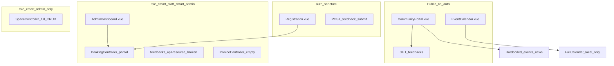

# Staff Dashboard & Administrative CRUD Audit

**Deliverable:** Save this document to [`.cursor/plans/staff_dashboard_crud_audit.plan.md`](.cursor/plans/staff_dashboard_crud_audit.plan.md) upon plan approval.

---

## Executive summary

The ecosystem has a **working 2-tier booking approval pipeline** (staff/admin) and **RBAC middleware**, but **four of five portal features are frontend-only dummy data** with no Laravel persistence. Staff tooling today is essentially [`AdminDashboard.vue`](frontend/src/AdminDashboard.vue) (bookings queue + profitability + Python analytics chart)—not a full CRUD console for portal content.

---

## Current State

### Authentication & middleware

| Layer | Location | Behavior |
|-------|----------|----------|
| Sanctum | [`backend/routes/api.php`](backend/routes/api.php) L34+ | Bearer token on authenticated routes |
| `role:cmart_staff,cmart_admin` | [`EnsureRole.php`](backend/app/Http/Middleware/EnsureRole.php) | Staff + Admin shared tier |
| `role:cmart_admin` | api.php L54-58 | Spaces CRUD only |
| `vendor.approved` | [`EnsureVendorApproved.php`](backend/app/Http/Middleware/EnsureVendorApproved.php) | Vendor booking submit |
| Frontend guard | [`router.js`](frontend/src/router.js) L54-80 | `/admin` requires `cmart_staff` or `cmart_admin` |

**Roles in use:** `community` (vendors/members), `cmart_staff`, `cmart_admin`, `uum` ([`auth.js`](frontend/src/stores/auth.js) `homeForUser()`).

---

### Staff/Admin Vue surfaces

| File | Route | What it does today |
|------|-------|-------------------|
| [`AdminDashboard.vue`](frontend/src/AdminDashboard.vue) | `/admin` | Tier 1/2 **booking approval queue** (PUT status), PDF view, profitability POST, Chart.js via Python `:8001` |
| [`WorkspaceShell.vue`](frontend/src/layouts/WorkspaceShell.vue) | Layout | Sidebar: Approval Queue, Profitability, Analytics (hash anchors only) |
| [`UumDashboard.vue`](frontend/src/UumDashboard.vue) | `/uum` | Placeholder “Planned Module”—no API |
| [`backend/resources/js/Pages/Dashboard.vue`](backend/resources/js/Pages/Dashboard.vue) | Inertia (legacy?) | Unrelated demo venue data—not wired to cmart API |

**No dedicated staff UI** for: calendar events, news posts, carboot schedule cards, or feedback moderation.

---

### API routes relevant to staff ([`api.php`](backend/routes/api.php))

**Public (no auth):**
- `GET /spaces`, `GET /spaces/{space}`
- `GET /feedbacks` → [`FeedbackController::index`](backend/app/Http/Controllers/Api/FeedbackController.php)
- `POST /feedback/{id}/helpful` → `markHelpful` (public, not throttled in current file)

**Vendor (`auth:sanctum` + `vendor.approved`):**
- `GET /vendor/bookings`, `POST /bookings`, `PATCH /vendor/bookings/{id}/resubmit`

**Staff/Admin (`auth:sanctum` + `role:cmart_staff,cmart_admin`):**
- `apiResource bookings` **except store** → index, show, update, destroy
- `POST /profitability`
- `apiResource invoices` → **all methods stubbed** in [`InvoiceController.php`](backend/app/Http/Controllers/Api/InvoiceController.php)
- `apiResource feedbacks` **except store, index** → routes registered for show/update/destroy but **methods do not exist** in FeedbackController (will error if called)

**Admin only (`role:cmart_admin`):**
- `POST/PUT/PATCH/DELETE /spaces` → full [`SpaceController`](backend/app/Http/Controllers/Api/SpaceController.php) CRUD

**Members (`auth:sanctum`):**
- `POST /feedback/submit` (throttled)

---

### Controllers — implemented vs registered

#### [`BookingController.php`](backend/app/Http/Controllers/Api/BookingController.php) (strongest staff backend)

| Operation | Staff access | Notes |
|-----------|--------------|-------|
| **Create** | No (vendor `store` only) | Staff cannot create bookings on behalf of vendors |
| **Read** | `index()`, `show()` | AdminDashboard uses `GET /bookings` |
| **Update** | `update()` | Approval pipeline only: `Pending_Boss`, `Needs_Revision`, `Approved` — **`Rejected` exists in DB enum but is not allowed in validation or UI** |
| **Delete** | `destroy()` | Implemented; **not exposed in AdminDashboard UI** |
| **Monitor** | Partial | KPI counts in Vue; no `product_category` column in queue table |

#### [`FeedbackController.php`](backend/app/Http/Controllers/Api/FeedbackController.php)

| Operation | Status |
|-----------|--------|
| **Read (public)** | `index()` — working |
| **Create** | `store()` — members only |
| **Update / Delete / Show** | **Missing methods** despite `apiResource` routes |
| **Moderation** | No hide/flag/status field in schema |

#### [`SpaceController.php`](backend/app/Http/Controllers/Api/SpaceController.php)

Full CRUD — **admin-only routes**; staff cannot manage rentable space catalog.

#### [`InvoiceController.php`](backend/app/Http/Controllers/Api/InvoiceController.php)

Registered `apiResource` — **empty stubs** (no implementation).

#### Event / News / Schedule controllers

**None exist.** No models or migrations for `events`, `news`, or `carboot_dates`.

---

### Portal features vs data source (frontend)

| Portal section | Component | Data source today |
|----------------|-----------|-------------------|
| Community feedback list | [`CommunityPortal.vue`](frontend/src/CommunityPortal.vue) L113-151 | `GET /feedbacks` (live) |
| Upcoming Carboot dates | CommunityPortal L243-248 | **Hardcoded** `upcomingEvents` ref |
| Latest CMart Updates | CommunityPortal L250-255 | **Hardcoded** `latestNews` ref |
| Event calendar page | [`EventCalendar.vue`](frontend/src/EventCalendar.vue) L148-152 | **Hardcoded** FullCalendar `events` array; drag/create is **client-only** (`calendarApi.addEvent`) |
| Vendor booking | [`Registration.vue`](frontend/src/Registration.vue) | Live API; `booking_date` is vendor-chosen, not tied to master schedule |

---

## Missing Architecture

CRUD matrix for the **five core features** management requested:

### 1. Event Calendar (managing & monitoring event dates)

| C | R | U | D |
|---|---|---|---|
| Missing backend | Missing API | Missing API | Missing API |

- Calendar is a **public Vue page** with static events and local-only “Create Event” (no persistence).
- No staff route to manage calendar entries.
- **Overlap risk:** duplicates “Carboot Dates” concept—recommend **one `carboot_events` table** feeding both FullCalendar and portal cards.

### 2. Carboot Bookings (approve, reject, monitor slots)

| C | R | U | D |
|---|---|---|---|
| Vendor only | **Partial** (staff `index`/`show`) | **Partial** (approval status only) | Backend yes / **UI no** |

**Missing:**
- Staff **reject** flow (`Rejected` status not in `update()` validation)
- Staff **create** booking (admin-assisted registration)
- Staff **edit** booking fields (`space_id`, `booking_date`, `product_category`) outside revision flow
- Full booking registry UI (all statuses, filters, search)
- Invoice management (stub controller)
- `product_category` visible in staff table

### 3. Community Feedbacks (moderate, read, delete reviews)

| C | R | U | D |
|---|---|---|---|
| Members (`store`) | Public `index` + broken staff `show` | **Missing** | **Missing** |

**Missing:**
- `show`, `update`, `destroy` in FeedbackController (routes registered but not implemented)
- Staff moderation UI (list all, delete, optional hide/approve flag)
- Moderation fields (e.g. `is_hidden`, `moderation_status`) — not in [`feedbacks` migrations](backend/database/migrations/)
- AdminDashboard section for feedback

### 4. Carboot Dates / Scheduling (available sale dates)

| C | R | U | D |
|---|---|---|---|
| **None** | **None** | **None** | **None** |

- Portal “Upcoming Carboot Dates” = dummy array (day, month, title, status, capacity hints).
- Not linked to `bookings.booking_date` validation (vendors can pick any date).
- **Missing:** master schedule entity, capacity per date, “Available / Almost Full / Closed” logic, staff CRUD + public `GET` endpoint.

### 5. Latest CMart Updates / News (portal announcements)

| C | R | U | D |
|---|---|---|---|
| **None** | **None** | **None** | **None** |

- `latestNews` is hardcoded in CommunityPortal (title, excerpt, image URL, category, date).
- **Missing:** `news_posts` (or `announcements`) table, media storage, staff CMS UI, public feed API.

---

### Additional gaps (supporting CRUD)

- **Spaces:** CRUD exists but **staff cannot access**—only `cmart_admin`. May need staff read-only or shared access for operations.
- **Invoices:** Routes exist; controller empty—invoices created in `BookingController::store` only.
- **Python analytics** ([`python_analytics/main.py`](python_analytics/main.py)): read-only booking status aggregates—not a CRUD feature.

---

## Action Plan

### Phase A — Database & models (new domain tables)

- **Create migration** `create_carboot_events_table` — `title`, `starts_at`, `ends_at`, `status` (Available/AlmostFull/Closed), `description`, `max_slots` (optional), timestamps.
- **Create migration** `create_news_posts_table` — `title`, `excerpt`, `body`, `category`, `image_path` or `image_url`, `published_at`, `is_published`, `author_id`.
- **Optional migration** on `feedbacks` — `is_hidden` boolean default false for moderation.
- **Create models:** `CarbootEvent`, `NewsPost`; add `Feedback` Eloquent model (replace raw DB in controller).
- **Alter** [`Booking.php`](backend/app/Models/Booking.php) — optional `carboot_event_id` FK to tie vendor bookings to scheduled dates.

### Phase B — Backend API (new controllers + fix broken routes)

**New files:**
- [`backend/app/Http/Controllers/Api/CarbootEventController.php`](backend/app/Http/Controllers/Api/CarbootEventController.php) — full CRUD
- [`backend/app/Http/Controllers/Api/NewsPostController.php`](backend/app/Http/Controllers/Api/NewsPostController.php) — full CRUD

**Alter:**
- [`backend/routes/api.php`](backend/routes/api.php):
  - Public: `GET /events`, `GET /news`
  - Staff group: `apiResource events`, `apiResource news` (staff+admin)
  - Fix feedback routes: implement or remove unused `apiResource` methods
- [`backend/app/Http/Controllers/Api/FeedbackController.php`](backend/app/Http/Controllers/Api/FeedbackController.php):
  - Add `show`, `update` (hide/flag), `destroy`
  - Migrate to Eloquent `Feedback` model
- [`backend/app/Http/Controllers/Api/BookingController.php`](backend/app/Http/Controllers/Api/BookingController.php):
  - Extend `update()` to allow `Rejected` for staff/admin with state-machine rules
  - Optional staff `store` for manual bookings
  - Validate `booking_date` against published `carboot_events` (optional Phase C)
- [`backend/app/Http/Controllers/Api/InvoiceController.php`](backend/app/Http/Controllers/Api/InvoiceController.php) — implement `index`, `update` (payment_status) or remove dead routes

### Phase C — Staff Dashboard frontend (unified CRUD UI)

**New Vue modules (recommended split for maintainability):**
- [`frontend/src/views/staff/StaffBookingsPanel.vue`](frontend/src/views/staff/StaffBookingsPanel.vue) — full table, filters, reject/delete, product_category column
- [`frontend/src/views/staff/StaffFeedbackPanel.vue`](frontend/src/views/staff/StaffFeedbackPanel.vue) — list, delete, hide
- [`frontend/src/views/staff/StaffEventsPanel.vue`](frontend/src/views/staff/StaffEventsPanel.vue) — CRUD form + list (calendar preview link)
- [`frontend/src/views/staff/StaffNewsPanel.vue`](frontend/src/views/staff/StaffNewsPanel.vue) — CRUD with image upload
- [`frontend/src/views/staff/StaffSchedulePanel.vue`](frontend/src/views/staff/StaffSchedulePanel.vue) — OR merge with Events if single entity

**Alter:**
- [`frontend/src/AdminDashboard.vue`](frontend/src/AdminDashboard.vue) — tabbed shell or expand [`WorkspaceShell`](frontend/src/layouts/WorkspaceShell.vue) `navItems` for all modules
- [`frontend/src/router.js`](frontend/src/router.js) — optional child routes `/admin/bookings`, `/admin/feedback`, etc.
- [`frontend/src/CommunityPortal.vue`](frontend/src/CommunityPortal.vue) — replace dummy `upcomingEvents` / `latestNews` with `GET /events` and `GET /news`
- [`frontend/src/EventCalendar.vue`](frontend/src/EventCalendar.vue) — load `GET /events`; restrict create/edit/delete to staff (role-gated UI or separate staff calendar route)

**New shared frontend utilities:**
- [`frontend/src/constants/productCategories.js`](frontend/src/constants/productCategories.js) — already duplicated; centralize
- [`frontend/src/services/staffApi.js`](frontend/src/services/staffApi.js) — optional wrapper for staff endpoints

### Phase D — Admin-only vs staff permissions (policy decision)

- Extend [`api.php`](backend/routes/api.php) so `cmart_staff` can:
  - **Read** spaces (today admin-only write)
  - **CRUD** events/news (both tiers)
- Keep **destructive** space delete as `cmart_admin` only if required by management.

### Phase E — Seeders & PDF (polish)

- [`backend/database/seeders/DatabaseSeeder.php`](backend/database/seeders/DatabaseSeeder.php) — sample events + news in English
- [`backend/resources/views/invoices/booking.blade.php`](backend/resources/views/invoices/booking.blade.php) — add `product_category` line item

---

## File checklist summary

| Action | Files |
|--------|-------|
| **Create** | `CarbootEventController`, `NewsPostController`, migrations, models, 4-5 staff Vue panels |
| **Alter** | `api.php`, `BookingController`, `FeedbackController`, `AdminDashboard.vue`, `CommunityPortal.vue`, `EventCalendar.vue`, `router.js`, `WorkspaceShell.vue` |
| **Fix / remove** | `InvoiceController` stubs or implement; broken `feedbacks` apiResource methods |
| **No change needed for audit scope** | `python_analytics`, `UumDashboard` (until oversight CRUD is scoped separately) |

---

## Recommended build order

1. Fix **FeedbackController** staff routes + moderation migration (quick win, unblocks apiResource).
2. Add **CarbootEvent** + **NewsPost** backend + wire public portal reads.
3. Expand **AdminDashboard** navigation and booking panel (reject + delete + product_category).
4. Staff **Events/News** CRUD panels.
5. Refactor **EventCalendar** to API-driven; gate write actions by role.
6. Invoice + booking-to-event FK (optional hardening).
