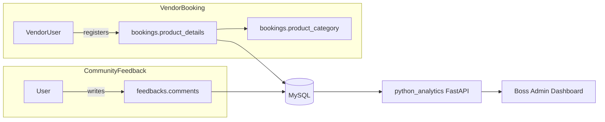
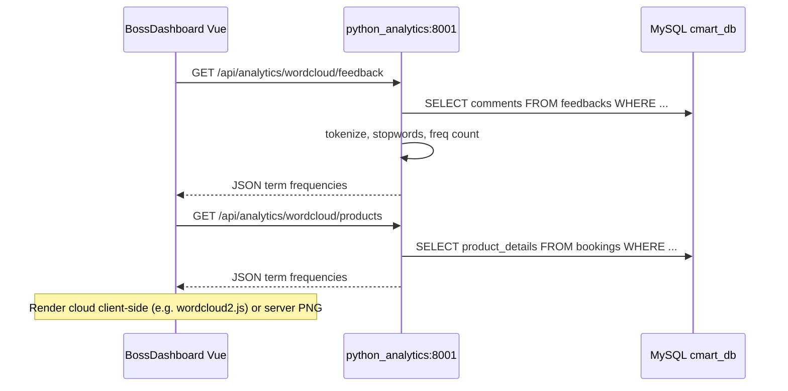

# Word Cloud Feature — Discovery Report & Architecture

## 1. Database Schemas (Textual Data Sources)

All migrations live under [`backend/database/migrations/`](backend/database/migrations/). There is **no separate `reviews` table** — community reviews are stored in **`feedbacks`** (the migration [`2026_05_20_013530_add_community_feedback_columns_to_reviews_table.php`](backend/database/migrations/2026_05_20_013530_add_community_feedback_columns_to_reviews_table.php) alters `feedbacks`, not a `reviews` table).

### Primary dataset A — Community / Customer Feedback

| Table | Column | Type | Purpose |
|-------|--------|------|---------|
| **`feedbacks`** | **`comments`** | `text` | Main free-text review body (max 50 words / 2000 chars enforced in [`FeedbackController`](backend/app/Http/Controllers/Api/FeedbackController.php)) |

Supporting columns useful for filtering or faceting (not primary NLP input):

- `id`, `user_id` (nullable), `reviewer_role`, `rating`, `service_rating`, `value_rating`
- `media_path`, `helpful_count`, `is_hidden` (default `false`), `created_at`, `updated_at`

**Recommended query filter for Boss dashboard:** all non-empty `comments` (include hidden for moderation view; use `WHERE is_hidden = 0` if a public-facing cloud is added later).

**API already exposed:** `GET /api/feedbacks` (public, visible only), `GET /api/staff/feedbacks` (staff, includes hidden) via [`backend/routes/api.php`](backend/routes/api.php).

**Seeded data:** no feedback rows in [`DatabaseSeeder`](backend/database/seeders/DatabaseSeeder.php) — corpus will be sparse until real submissions exist.

---

### Primary dataset B — Vendor Product Descriptions

Vendor offerings are captured at **booking time**, not in a dedicated `products` table.

| Table | Column | Type | Purpose |
|-------|--------|------|---------|
| **`bookings`** | **`product_details`** | `text` | Free-text list of items vendor will sell (e.g. "Ayam Gunting, Ramen") — added in [`2026_06_02_151600_add_product_details_to_bookings_table.php`](backend/database/migrations/2026_06_02_151600_add_product_details_to_bookings_table.php) |
| **`bookings`** | **`product_category`** | `string` | Controlled category (e.g. "Food & Beverages") — useful as a facet, less useful for word-cloud tokenization |

Collected in [`frontend/src/Registration.vue`](frontend/src/Registration.vue) and validated in [`BookingController`](backend/app/Http/Controllers/Api/BookingController.php) (`required|string|max:5000`).

**Recommended query filter for Boss dashboard:** `WHERE product_details IS NOT NULL AND product_details != ''` — optionally restrict to `approval_status = 'Approved'` to reflect active vendor inventory only.

**Seeded data:** one demo row with `product_details = 'Ayam Gunting, Ramen'` in `DatabaseSeeder`.

---

### Secondary text sources (optional, not requested for v1)

| Table | Text columns | Notes |
|-------|--------------|-------|
| `bookings` | `revision_comment` | Staff workflow notes — operational, not customer/vendor marketing text |
| `booking_audit_logs` | `revision_comment` | Audit trail of status changes |
| `news_posts` | `title`, `excerpt`, `body` | CMS-style announcements |
| `carboot_events` | `title`, `description` | Event metadata |

These are **not** the canonical feedback or vendor-product corpora.

---

### Entity relationship (text flow)

---

## 2. Python Analytics Environment

**Location:** [`python_analytics/`](python_analytics/)

### Files currently present

| File | Role |
|------|------|
| [`python_analytics/main.py`](python_analytics/main.py) | Sole application file — FastAPI service |
| `python_analytics/__pycache__/main.cpython-314.pyc` | Compiled bytecode (Python **3.14** runtime detected) |

No submodules, scripts, tests, Dockerfile, virtualenv, or `.env` in this directory.

### Dependency / setup status

| Item | Status |
|------|--------|
| `requirements.txt` | **Missing** |
| `pyproject.toml` / `Pipfile` / `poetry.lock` | **Missing** |
| Documented run command | **Missing** (implicit: `uvicorn main:app`) |
| Committed virtualenv | **None** |

### Libraries in use today (from `main.py` imports only)

| Library | Used for | NLP / Word Cloud? |
|---------|----------|-------------------|
| `fastapi` | HTTP API | No |
| `fastapi.middleware.cors.CORSMiddleware` | CORS for Vue | No |
| `mysql.connector` | Direct MySQL reads | No |
| `pandas` | SQL → DataFrame aggregation | Data wrangling only |

**Not present:** `wordcloud`, `nltk`, `spacy`, `scikit-learn`, `matplotlib`, `Pillow`, etc.

### Existing API behavior

[`python_analytics/main.py`](python_analytics/main.py) exposes:

- `GET /` — health check
- `GET /api/analytics/status-summary` — counts `bookings.approval_status` via pandas

**Database connection:** hardcoded XAMPP defaults — `host=localhost`, `user=root`, `password=""`, `database="cmart_db"`. Laravel's [`.env.example`](backend/.env.example) defaults to `DB_DATABASE=laravel`; operators must ensure Laravel and Python point at the **same** database name in practice.

**Frontend integration:** **None yet.** Vue uses [`frontend/src/services/api.js`](frontend/src/services/api.js) with `baseURL: http://127.0.0.1:8000/api` (Laravel only). Boss revenue analytics is served by Laravel [`BossAnalyticsController`](backend/app/Http/Controllers/Api/BossAnalyticsController.php), not Python.

---

## 3. Architectural Recommendation — Laravel ↔ Python Bridge

Given the existing FastAPI microservice pattern, extend it rather than introducing subprocess calls from Laravel.

### Recommended approach: Extend FastAPI + Boss dashboard consumes JSON

**Why this fits the codebase:**

1. **Precedent exists** — Python already reads the same MySQL DB independently of Laravel ORM.
2. **CORS is pre-configured** — FastAPI allows all origins; Vue can call a separate port (e.g. `8001`) without Laravel changes.
3. **Boss scope confirmed** — two endpoints align with your choice: feedback corpus + vendor product corpus, both for Admin/Boss analytics (alongside existing [`BossRevenuePanel.vue`](frontend/src/views/boss/BossRevenuePanel.vue)).
4. **Laravel stays thin** — no need to duplicate NLP in PHP; Boss auth can remain on Laravel routes if you add a Laravel proxy later.

### Implementation outline (future work, not in this phase)

1. **Add [`python_analytics/requirements.txt`](python_analytics/requirements.txt)** pinning: `fastapi`, `uvicorn`, `mysql-connector-python`, `pandas`, plus `wordcloud` and `nltk` (or lighter tokenization with `regex` + stopword list if you want fewer deps).
2. **Externalize DB config** — read `DB_HOST`, `DB_DATABASE`, `DB_USERNAME`, `DB_PASSWORD` from env (mirror Laravel `.env`) instead of hardcoding `cmart_db`.
3. **New endpoints:**
   - `GET /api/analytics/wordcloud/feedback` — `SELECT comments FROM feedbacks WHERE comments IS NOT NULL AND TRIM(comments) != ''`
   - `GET /api/analytics/wordcloud/products` — `SELECT product_details FROM bookings WHERE approval_status = 'Approved' AND product_details IS NOT NULL`
   - Return `{ "terms": [{"text": "ramen", "weight": 12}, ...], "total_documents": N }` for flexible Vue rendering.
4. **Frontend:** add a Boss analytics panel (or extend Admin `#analytics` section) calling FastAPI on port `8001`; optionally add a Vite dev proxy entry in [`frontend/vite.config.js`](frontend/vite/config.js) for `/analytics-python`.
5. **Auth consideration:** FastAPI endpoints are currently open. For Boss-only data, either:
   - **Option A (simplest):** restrict FastAPI to localhost + Boss UI only in dev; or
   - **Option B (production-safe):** Laravel proxy route `GET /api/boss/analytics/wordcloud/{source}` that validates Boss role, then HTTP-calls Python internally.

### Alternatives considered (not recommended as primary)

| Approach | Pros | Cons |
|----------|------|------|
| Laravel `Process::run('python ...')` | Single port | Blocks request, harder to scale, no existing pattern |
| Pure Laravel/PHP word freq | One service | No NLP ecosystem; duplicates analytics split |
| Pre-render PNG in Python only | Simple display | Less interactive; harder to filter/drill-down in Vue |

### Suggested default tokenization strategy

- **Feedback:** lowercase, strip punctuation, remove English + common Malay stopwords, min token length 2.
- **Products:** treat comma-separated phrases as units first (`Ayam Gunting`), then tokenize individual words — vendors enter comma-delimited lists per the Registration UI placeholder.

---

## 4. Gaps & Risks to Address Before Implementation

- **Sparse seed data** — word clouds will look empty until feedback submissions and bookings accumulate.
- **No `requirements.txt`** — reproducible Python setup must be created before any NLP libs are added.
- **DB name mismatch risk** — Python uses `cmart_db`; Laravel example uses `laravel`; confirm production `.env` alignment.
- **No Python service orchestration** — document running `uvicorn main:app --port 8001` alongside `php artisan serve` and Vite.
- **Security** — open FastAPI endpoints should not expose hidden feedback to unauthenticated callers; Boss proxy or API key recommended for production.

---

## 5. Summary

| Question | Finding |
|----------|---------|
| Where is community feedback text? | **`feedbacks.comments`** |
| Where are vendor product descriptions? | **`bookings.product_details`** (+ **`product_category`** for grouping) |
| Python setup maturity? | Minimal — one FastAPI file, pandas + mysql.connector, **no NLP deps, no requirements.txt** |
| Best bridge? | **Extend existing FastAPI service** with two Boss-targeted word-cloud endpoints reading MySQL directly; Vue Boss dashboard consumes JSON term frequencies |
