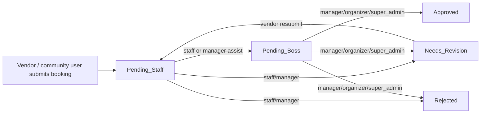
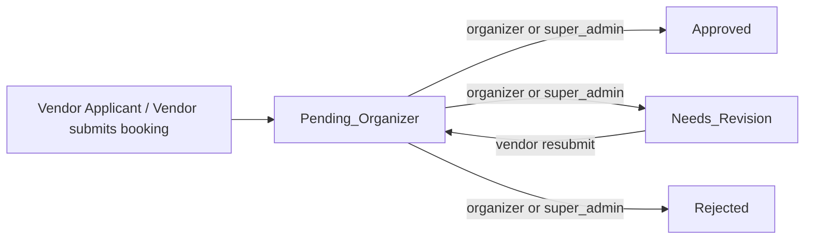

# Phase 1.3B — Direct Organizer Workflow Final Diagnosis

**Status:** Final diagnosis and Phase 1.3C blueprint only — no code, migration, seeder, test, route, frontend, or data changes performed.  
**Date:** 2026-07-11  
**Builds on:** [`phase-1-3a-role-simplification-audit.md`](phase-1-3a-role-simplification-audit.md)  
**Next phase:** 1.3C implementation (not started)

---

## 1. Executive summary

Phase 1.3A correctly identified role identity debt and Phase 1.2 analytics boundaries. **The latest governance decision supersedes 1.3A’s recommendation to keep `staff` temporarily.** The staff interception step is now considered **governance-incorrect**, not merely legacy naming.

### Current state (verified)

| Layer | State |
|---|---|
| DB roles | `community, staff, manager, organizer, cmart_management, super_admin, uum` |
| Local users per role | 1 each for all roles except `uum` (0) |
| Booking statuses (ENUM) | `Pending_Staff, Needs_Revision, Pending_Boss, Approved, Rejected, Cancelled, Withdrawn` |
| Local booking counts | `Approved: 2`, `Withdrawn: 1` (no in-flight pipeline rows locally) |
| Workflow | Two-stage: `Pending_Staff` → `Pending_Boss` → terminal states |
| CMart Management analytics boundary | **Already enforced** (Phase 1.2) |
| CMart Management booking boundary | **Already enforced** at route level (`cmart_management` ∉ `carbootOperationalRoles()`) |
| Staff booking intercept | **Fully implemented** — this is the primary 1.3C refactor target |

### Target state

| Layer | Target |
|---|---|
| DB roles | `community, organizer, cmart_management, super_admin` |
| Workflow | Vendor/applicant submits → **`Pending_Organizer`** → Approved / Rejected / Needs_Revision |
| CMart Management | Side activities + generated reports only; **zero** booking pipeline authority |
| Organizer | Sole Carboot booking approver, ops desk, analytics, payment verification, pass check-in |

### Phase 1.3C recommendation

**Proceed** — split into **three PRs** (see §14). Do **not** implement as one monolithic PR. Role migration and booking status migration must deploy in a coordinated sequence but can be separated by layer (backend data → backend logic → frontend/tests).

### Critical finding

Removing `staff` as a booking gatekeeper is **larger in scope than removing `manager`/`uum` as role labels**. It requires:

1. Booking status ENUM migration (`Pending_Staff` / `Pending_Boss` → `Pending_Organizer`)
2. State machine rewrite in `BookingController`
3. Removal of Staff Portal Assist, dual queues, and `/staff/*` booking APIs as operational paths
4. Rewriting ~15 E2E specs and ~5 backend feature tests tied to the two-stage pipeline

---

## 2. Latest governance decision

| # | Rule |
|---|---|
| 1 | UUM = Organizer |
| 2 | `organizer` is canonical for UUM / Carboot Organizer |
| 3 | `manager` must not remain as a final role |
| 4 | `uum` must not remain as a final role |
| 5 | `staff` must not remain as a final role if it only exists to intercept Carboot bookings |
| 6 | `admin` is never a DB role |
| 7 | CMart Management = single role `cmart_management` |
| 8 | CMart Management has **no authority** in core Carboot booking/approval workflow |
| 9 | CMart Management: venue/side activities + generated reports only |
| 10 | Booking workflow: **direct** Vendor/Applicant → Organizer review |

### Public / community / vendor entity model (target)

| Concept | Storage | Access |
|---|---|---|
| Public Visitor | Not in `users` | Public routes only |
| Community Member | `role=community`, `vendor_status=none` | Dashboard/profile, can apply |
| Vendor Applicant | `role=community`, `vendor_status=pending` (+ booking intent) | `/dashboard` must remain accessible |
| Vendor | `role=community`, `vendor_status=approved` | Vendor features per booking/payment rules |

No separate `vendor` DB role unless code proves unavoidable — **code does not require it today**.

---

## 3. Delta from Phase 1.3A

| Topic | Phase 1.3A recommendation | Latest decision | Superseded? |
|---|---|---|---|
| `staff` role | **Keep temporarily** (Option A) as Carboot ops sub-role | **Remove** from booking authority; migrate personnel to `cmart_management` | **Yes — fully superseded** |
| Two-stage pipeline | Preserve until workflow redesign | **Remove now** in 1.3C | **Yes** |
| `staff` vs `cmart_management` merge | Do not merge (different capabilities) | Migrate **accounts** `staff→cmart_management`; strip Carboot ops from result | **Partially superseded** — account migration yes, booking authority no |
| Interim ENUM with `staff` | `community \| staff \| organizer \| cmart_management \| super_admin` | Final ENUM **without** `staff`, `manager`, `uum` | **Yes** |
| `manager` / `uum` → `organizer` | Migrate then remove | Same | No change |
| Analytics boundaries | Already sound | Same | No change |
| `admin` as workspace path | Keep `/admin` as route label | Same | No change |
| Vendor = `community` + `vendor_status` | Keep | Same, with clearer user-facing terminology | Extended |

### What 1.3A got right (still valid)

- Phase 1.2 capability layer is the correct enforcement model
- `cmart_management` is already denied raw analytics and carboot operational routes
- `manager` and `uum` are identity debt, not separate long-term authorities
- Single `users` table with `vendor_status` is correct

---

## 4. Direct Organizer workflow diagnosis

### 4.1 Current workflow (as implemented)



**Governance violation:** CMart-side `staff` role sits between vendor and Organizer-equivalent final approval.

### 4.2 Target workflow (1.3C)



**No** `Pending_Staff`, **no** `Pending_Boss`, **no** forward action, **no** Staff Portal Assist.

### 4.3 Core backend state machine (today)

Source: `BookingController::STATE_TRANSITIONS`

| Workflow key (`workflowRoleKey`) | From | Allowed targets |
|---|---|---|
| `staff` | `Pending_Staff` | `Pending_Boss`, `Needs_Revision`, `Rejected` |
| `manager` | `Pending_Staff` | `Pending_Boss`, `Needs_Revision`, `Rejected` |
| `manager` | `Pending_Boss` | `Approved`, `Needs_Revision`, `Rejected` |

Notes:

- `workflowRoleKey()` maps `organizer` and `super_admin` → `'manager'` for transitions
- New bookings created with `approval_status = 'Pending_Staff'`
- Vendor resubmit sets status back to `Pending_Staff`
- `queueStatusForUser()`: manager-workflow roles see `Pending_Boss` queue; others see `Pending_Staff`

### 4.4 Target backend state machine (1.3C)

| Workflow key | From | Allowed targets |
|---|---|---|
| `organizer` | `Pending_Organizer` | `Approved`, `Needs_Revision`, `Rejected` |
| `super_admin` | `Pending_Organizer` | Same (unless later nerfed — see open questions) |

Remove `workflowRoleKey()` manager/staff indirection; use `organizer` explicitly or capability `carboot_operations`.

### 4.5 Features to remove (not preserve)

| Feature | Reason |
|---|---|
| Staff forward to manager queue | Entire second stage removed |
| Dual queue (`staffQueueStatus` / `managerQueueStatus`) | Single Organizer queue |
| Staff Portal Assist (`bossPreview.viewAsStaff`) | Simulates staff intercept |
| `/api/staff/bookings` as primary staff registry | Organizer uses `/api/bookings` |
| `read_only` staff registry access mode | No staff booking desk |
| Tier 1 / Tier 2 approval wording | Replaced by Organizer review |

### 4.6 Features to preserve under Organizer

| Feature | Current owner | 1.3C owner |
|---|---|---|
| Booking approve / reject / request revision | manager-equivalent | **organizer** (+ super_admin if retained) |
| Payment proof verification (`verify-payment`) | all carboot operational roles incl. staff | **organizer** (+ super_admin if retained) |
| Pass verify / check-in (`/staff/bookings/{id}/verify`, check-in) | carboot operational roles | **organizer** (rename route prefix away from `/staff/`) |
| Carboot event CRUD | carboot operational roles incl. staff | **organizer** |
| Booking delete | boss/analytics gate | **organizer** |
| Raw analytics | organizer-equivalent | **organizer** |
| Generated reports | organizer + cmart_management | unchanged |
| Audit logging | all transitions | **organizer** actions; preserve historical log rows |

---

## 5. Booking status dependency map

### 5.1 Current statuses (complete inventory)

| Status | Storage | Default for new booking? | Active in code? |
|---|---|---|---|
| `Pending_Staff` | MySQL ENUM | **Yes** | **Yes — primary entry state** |
| `Pending_Boss` | MySQL ENUM | No | **Yes — manager queue** |
| `Needs_Revision` | MySQL ENUM | No | Yes |
| `Approved` | MySQL ENUM | No | Yes |
| `Rejected` | MySQL ENUM | No | Yes |
| `Cancelled` | MySQL ENUM | No | Yes |
| `Withdrawn` | MySQL ENUM | No | Yes |

Legacy removed from ENUM: `Pending` (migrated to `Pending_Staff` in `2026_05_12_000002`).

### 5.2 Recommended target statuses

| Status | Purpose |
|---|---|
| `Pending_Organizer` | New submission and post-resubmit queue |
| `Needs_Revision` | Organizer requested changes |
| `Approved` | Terminal success |
| `Rejected` | Terminal failure |
| `Cancelled` | Organizer/system cancellation |
| `Withdrawn` | Vendor-initiated withdrawal |

**Do not add** separate `Submitted` unless product needs distinguish new vs resubmit — current resubmit flow can reuse `Pending_Organizer`.

### 5.3 Dependency classification table

| File / behavior | Classification | 1.3C action |
|---|---|---|
| **Backend** | | |
| `BookingController::STATE_TRANSITIONS` | Must remove / rewrite | Single organizer matrix |
| `BookingController::store()` → `Pending_Staff` | Must migrate | → `Pending_Organizer` |
| `BookingController::resubmit()` → `Pending_Staff` | Must migrate | → `Pending_Organizer` |
| `BookingController::queueStatusForUser()` | Must remove | Single `Pending_Organizer` queue |
| `BookingController::bookingSummaryCounts()` pending_staff/pending_boss | Must rename | → `pending_organizer` |
| `BookingController::update()` validation `in:Pending_Boss,...` | Must migrate | Remove `Pending_Boss`; add `Pending_Organizer` if needed |
| `BookingController` Staff Portal Assist audit action | Must remove | — |
| `StaffOperationsController::pending_staff_review` | Must rename | → `pending_organizer_review` |
| `ManagementReportsPanel` card label | Must rename | UI + API key alignment |
| `VendorBookingPresenter::WITHDRAWABLE_STATUSES` | Must migrate | Replace `Pending_Staff`/`Pending_Boss` with `Pending_Organizer` |
| `VendorEventPassService` pending checks | Must migrate | Status list update |
| `MarketplaceEligibility` (if references statuses) | Must migrate | Audit and update |
| `resources/views/invoices/booking.blade.php` Tier 1/2 copy | Must rename | Organizer-only wording |
| Migrations (historical) | Preserve as history | New forward migration only |
| **New migration** | Needs DB migration | Remap rows + shrink ENUM |
| **Frontend** | | |
| `bookingDisplay.js` pipeline steps | Must remove / rewrite | Single Organizer Review step |
| `ManagementStatusChip.vue` | Must rename | Pending_Organizer label |
| `StaffBookingsPanel.vue` forward action | Must remove | Organizer approve/reject/revision only |
| `StaffBookingsPanel.vue` queue filters | Must rename | Remove staff/manager queue options |
| `useManagementAccess.js` staff/manager queues | Must remove | Single organizer queue |
| `bossPreview.js` / Staff Portal Assist | Must remove | Delete store usage |
| `AdminDashboard.vue` assist banner/toggle | Must remove | — |
| `managementWorkspaceTheme.js` staff theme | Must migrate | Remove staff theme key; organizer-only ops desk |
| `vendorOnboarding.js` copy ("CMart staff will review") | Must rename | Organizer review copy |
| `VendorPaymentModal.vue` "CMart staff will verify" | Must rename | Organizer wording |
| `VendorCheckoutPage.vue` verification copy | Must rename | — |
| **Tests** | | |
| `BookingStaffStageAssistTest.php` | Delete / replace | New `OrganizerBookingWorkflowTest` |
| E2E `staff.booking-forward.spec.js` | Delete | — |
| E2E `manager.staff-portal-assist.spec.js` | Delete | — |
| E2E `staff.booking-review.spec.js` | Replace | `organizer.booking-review.spec.js` |
| E2E `manager.booking-approval.spec.js` | Replace | `organizer.booking-approval.spec.js` |
| E2E helpers `staff-bookings.js` forward/approve | Must migrate | Direct organizer approve from `Pending_Organizer` |
| **Audit logs** | | |
| Historical `from_status`/`to_status` values | Preserve as history | Do not rewrite audit rows; optional display mapping |
| New audit entries | Must preserve under Organizer | action labels without staff/manager |

### 5.4 Status migration SQL (plan only)

```sql
-- Backup first (see §6)
UPDATE bookings SET approval_status = 'Pending_Organizer' WHERE approval_status IN ('Pending_Staff', 'Pending_Boss');
-- Then ALTER ENUM to remove Pending_Staff, Pending_Boss; add Pending_Organizer; set DEFAULT 'Pending_Organizer'
```

**Local DB:** No rows currently in `Pending_Staff` or `Pending_Boss` — low local risk; **production may differ**.

### 5.5 Separate vs combined migration with roles

**Recommendation: two migrations, one deploy window**

| Migration | Scope | Why separate |
|---|---|---|
| `2026_07_xx_remap_legacy_user_roles.php` | users.role remap + ENUM shrink | Different table, rollback independent |
| `2026_07_xx_direct_organizer_booking_statuses.php` | bookings.approval_status remap + ENUM shrink | Different table; can run immediately after role migration |

Deploy both in same release **before** code that only understands new values goes live (or deploy code that accepts both during transition — **not recommended**; prefer maintenance window / single cutover).

---

## 6. Role migration diagnosis

### 6.1 Local user counts (verified 2026-07-11)

| Role | Count |
|---|---|
| `community` | 1 |
| `staff` | 1 (`staff@cmart.com`) |
| `manager` | 1 (`admin@cmart.com`) |
| `organizer` | 1 (`organizer@cmart.com`) |
| `cmart_management` | 1 (`venue@cmart.com`) |
| `super_admin` | 1 (`hq@cmart.com`) |
| `uum` | 0 |

### 6.2 Seeder accounts (`DatabaseSeeder.php`)

| Email | Current role | 1.3C target role |
|---|---|---|
| `vendor@cmart.com` | `community` (approved) | unchanged |
| `vendor_b@cmart.com` | `community` (approved) | unchanged |
| `admin@cmart.com` | `manager` | **`organizer`** (or deprecate in favor of `organizer@cmart.com`) |
| `staff@cmart.com` | `staff` | **`cmart_management`** (venue-side personnel) |
| `hq@cmart.com` | `super_admin` | unchanged |
| `organizer@cmart.com` | `organizer` | unchanged (canonical demo) |
| `venue@cmart.com` | `cmart_management` | unchanged |
| *(none)* | `uum` | not seeded |

### 6.3 Role remapping plan

| From | To | Condition |
|---|---|---|
| `manager` | `organizer` | All rows |
| `uum` | `organizer` | All rows |
| `staff` | `cmart_management` | All rows representing CMart-side personnel |

**Important:** After remap, former `staff@cmart.com` must **not** retain carboot operational capabilities — capability layer must deny `carboot_operations` for `cmart_management` (already true).

### 6.4 Backup table (required before remap)

```sql
CREATE TABLE role_migration_audit_202607 AS
SELECT id, email, role, vendor_status, updated_at FROM users;
```

Optional booking backup:

```sql
CREATE TABLE booking_status_migration_audit_202607 AS
SELECT id, user_id, approval_status, updated_at FROM bookings;
```

### 6.5 Rollback risks

| Risk | Mitigation |
|---|---|
| Cannot distinguish manager vs uum vs organizer after merge | Backup table with original role |
| staff→cmart_management removes booking desk access unexpectedly | Communicate to stakeholders; update demo credentials |
| ENUM shrink fails if stray values exist | VARCHAR widen → remap → narrow (existing pattern) |
| E2E `E2E_STAFF_*` credentials become cmart_management | Update `.env.e2e` and docs |
| E2E `E2E_MANAGER_*` must become organizer | Point to `organizer@cmart.com` or migrated `admin@` |

### 6.6 Factories / tests creating legacy roles

| Location | Roles used |
|---|---|
| `BookingStaffStageAssistTest` | creates `staff`, `manager` inline |
| `ManagementCapabilityTest` | `staff`, `manager` constants |
| `GovernanceAccessBoundaryTest` | seeded `staff`, `admin@` manager |
| `WebAnalyticsSecurityTest` | seeded staff, manager |
| `StaffOperationsSummaryTest` | seeded staff, manager |
| `FeedbackModerationTest` | seeded staff, manager |
| `CommunityVendorIntentTest` | seeded staff (negative case) |
| `UserFactory` | no role default — tests set explicitly |
| E2E 22 specs | extensive staff/manager usage |

---

## 7. CMart Management boundary diagnosis

### 7.1 Intended boundary (target)

| Allowed | Denied |
|---|---|
| CMart news / side activities (`news-posts`) | Raw Carboot analytics |
| Generated reports (`/management/reports/*`) | Booking list / approve / reject |
| Public calendar/event info (read) | Staff/organizer queues |
| Report request UI (future) | Payment verification |
| | Vendor approval workflow |
| | Pass check-in / booking verify |
| | Carboot event CRUD |

### 7.2 Current enforcement (mostly correct)

| Check | Status |
|---|---|
| `cmart_management` ∉ `carbootOperationalRoles()` | **Pass** — blocked from `/api/bookings`, `/api/staff/*`, carboot-events |
| `cmart_management` denied `carboot_operational_analytics` | **Pass** |
| `cmart_management` has `generated_reports` + `cmart_activity_management` | **Pass** |
| `GovernanceAccessBoundaryTest` | **Pass** |
| `WebAnalyticsSecurityTest` | **Pass** |

### 7.3 Violations or gaps (must fix in 1.3C)

| Issue | Severity | Location | Fix |
|---|---|---|---|
| Generated report shows **"Pending Staff Review"** | Medium (wording + semantics) | `StaffOperationsController`, `ManagementReportsPanel.vue` | Rename to Organizer queue metric; exclude from CMart “actionable queue” framing |
| Vendor onboarding says **"CMart management/staff will review"** | High (stakeholder meaning) | `vendorOnboarding.js` | Organizer review copy |
| Payment modal says **"CMart staff will verify"** | High | `VendorPaymentModal.vue` | Organizer verification copy |
| Invoice PDF **Tier 1 CMart Staff** pipeline text | Medium | `invoices/booking.blade.php` | Organizer-only pipeline |
| **`staff` role in `carbootOperationalRoles()`** | **Critical governance debt** | `ManagementRole.php`, `api.php` route group | Remove staff from carboot ops list entirely |
| **`staff` has `carboot_operations` capability** | **Critical** | `ManagementCapability.php` | Remove staff from capability lists |
| Site footer **"Staff Portal"** link | Low | `SiteFooter.vue` | Management login / CMart Management wording |

### 7.4 No violation found

- CMart Management cannot hit boss analytics or booking mutation routes today
- Route-level denial is stronger than nav hiding alone

---

## 8. Organizer authority diagnosis

### 8.1 Authority that must consolidate under Organizer

| Capability | Currently also held by | 1.3C action |
|---|---|---|
| Booking submission review / approval | `staff` (forward only), `manager`, `organizer`, `super_admin` | **Organizer only** (+ super_admin TBD) |
| Payment verification | staff, manager, organizer, super_admin | **Organizer** |
| Pass verify / check-in | carboot operational roles incl. staff | **Organizer** |
| Carboot event CRUD | carboot operational roles incl. staff | **Organizer** |
| Feedback publish/delete | organizer-equivalent | **Organizer** |
| Raw analytics + audit | organizer-equivalent | **Organizer** |
| Space mutate / booking delete | boss gate | **Organizer** |
| Generated reports | organizer + cmart_management | Organizer keeps; CMart read-only |

### 8.2 Authority to remove from legacy roles

| Role | Remove |
|---|---|
| `staff` | All carboot booking pipeline authority |
| `manager` | Role eliminated; powers → organizer |
| `uum` | Role eliminated; powers → organizer |
| `cmart_management` | Already excluded — verify no regression when staff removed |

### 8.3 `super_admin` nuance

Today `super_admin` inherits full Organizer workflow via `workflowRoleKey()` and `isOrganizerEquivalent()`. Governance says reserved/technical. **1.3C default:** keep functional parity to avoid breaking HQ demo account; **later phase** may nerf daily ops. Document in release notes.

---

## 9. Public / community / vendor entity diagnosis

### 9.1 Current implementation

| Concept | How coded today | Gap vs target terminology |
|---|---|---|
| Public Visitor | No auth; public routes | OK |
| Community Member | `role=community`, `vendor_status=none`, `community_mode=visitor` | Label mostly OK |
| Vendor Applicant | `role=community`, `vendor_status=pending` and/or booking exists | **No explicit "Vendor Applicant" label**; onboarding copy says "CMart staff" |
| Vendor | `role=community`, `vendor_status=approved` | OK structurally |

### 9.2 Key files

| File | Role |
|---|---|
| `CommunityVendorIntent.php` | Derives `is_vendor_user`, `community_mode`, `vendor_signals` |
| `UserAuthPresenter.php` | Exposes vendor_status + intent |
| `auth.js` | `isVendorUser`, `communityMode`, dashboard routing |
| `EnsureVendorApproved.php` | Registered but **not applied** — pending vendors keep dashboard |
| `GovernanceAccessBoundaryTest` | Confirms pending vendor API access |
| `router.js` | `/dashboard` requires `community` role only (not vendor_status) |

### 9.3 Vendor approval model

- **No separate vendor admin approval API** found
- `vendor_status` is set at registration (`none`) and legacy migration; booking approval is separate from vendor_status
- Product may conflate "vendor applicant" (has booking pending) with `vendor_status=pending` — **both should keep dashboard access**

### 9.4 Recommended terminology (1.3C UI pass)

| Internal (DB) | User-facing |
|---|---|
| `role=community`, no vendor signals | Community Member |
| `role=community`, `vendor_status=pending` OR active booking pipeline | Vendor Applicant |
| `role=community`, `vendor_status=approved` | Vendor |
| not logged in | Public Visitor |

Backend stays: `role=community` + `vendor_status` + profiles + bookings.

---

## 10. Frontend / navigation terminology diagnosis

### 10.1 Must remove or replace (visible)

| Current | Target |
|---|---|
| Staff / Staff Portal / Staff Queue | Remove or replace with **Organizer Operations** where ops desk remains |
| Manager / Manager Review / Manager Portal | **Organizer** / **Organizer Review** / **Organizer Workspace** |
| Boss / isBoss / bossPreview | Code may alias internally; UI → Organizer |
| UUM Oversight | Remove `/uum` or redirect to Organizer workspace |
| Admin (as role label) | **Management workspace** or **Organizer workspace** |
| Pending Staff / Pending Boss | **Pending Organizer Review** / `Pending_Organizer` |
| Awaiting Staff / Awaiting Manager (chips) | **Awaiting Organizer** |
| CMart Venue Manager (role label) | **CMart Management** |
| Carboot Organizer (Legacy) | Remove after manager migration |
| Staff Portal Assist banner/toggle | **Delete** |

### 10.2 Preferred nav groups (already partially aligned)

| Group | Audience |
|---|---|
| Carboot Operations | Organizer |
| Carboot Analytics | Organizer |
| Generated Reports | Organizer + CMart Management |
| CMart Activities / Side Activities | CMart Management (+ Organizer if shared) |
| System / Tools | Organizer ops utilities only |

### 10.3 CMart Management default landing

Already `defaultManagementHashForRole(cmart_management) → 'news'` — **keep**.

Organizer default → `'bookings'` — **keep**.

---

## 11. Backend route / middleware impact

### 11.1 Routes to change in 1.3C

| Route group | Current middleware | 1.3C change |
|---|---|---|
| Carboot ops block | `carbootOperationalRoles()` incl. **staff**, manager, organizer, super_admin | **organizer + super_admin only** |
| Nested organizer actions | `organizerEquivalentRoles()` incl. manager | **organizer + super_admin** |
| `/api/staff/bookings` | carboot ops | **Remove or 410**; clients use `/api/bookings` |
| `/api/staff/operations-summary` | carboot ops | Move metric keys; restrict write paths; consider organizer-only with sanitized export for reports controller |
| `/api/staff/feedbacks` | carboot ops | Organizer-only |
| `/api/staff/bookings/{id}/verify`, check-in | carboot ops | Rename prefix e.g. `/api/operations/bookings/...` or keep under organizer auth |
| `PATCH /bookings/{id}/verify-payment` | carboot ops (staff can verify) | **Organizer-only** |
| `news-posts` | cmartActivityRoles (includes staff, manager) | **organizer + cmart_management + super_admin** (remove staff/manager) |
| `boss` analytics | organizer-equivalent | organizer + super_admin |
| `capability:generated_reports` | already correct | Remove manager from capability resolver |

### 11.2 Middleware / kernel

| Item | Action |
|---|---|
| `EnsureBossOnly` | Rename comment/alias toward `carboot_analytics`; remove `manager` alias confusion |
| `workflowRoleKey()` | Remove or reduce to organizer-only |
| `EnsureRole` 403 message "Manager access required" | "Organizer access required" |

### 11.3 Frontend route impact

| Route | Action |
|---|---|
| `/uum` | Redirect to `/admin` or remove |
| `/staff/verify-booking/:id` | Rename to organizer ops path or keep path with updated role guard |
| `/admin` hash guards using `workflowRoleKey === MANAGER` | Use organizer capability checks |

---

## 12. Test impact map

### 12.1 Backend feature tests

| Test file | Action | Notes |
|---|---|---|
| `ManagementCapabilityTest` | **Update** | Remove staff carboot ops asserts; remove manager bridge test eventually |
| `BookingStaffStageAssistTest` | **Delete → replace** | New organizer single-stage workflow tests |
| `GovernanceAccessBoundaryTest` | **Update** | organizer primary; add cmart_management denied booking PATCH |
| `WebAnalyticsSecurityTest` | **Update** | Replace manager with organizer; remove staff carboot ops assumptions |
| `StaffOperationsSummaryTest` | **Update/rename** | Metric keys; cmart_management may still consume via reports endpoint |
| `FeedbackModerationTest` | **Update** | staff review → organizer or split CMart vs Carboot moderation |
| `CommunityVendorIntentTest` | **Update** | staff negative case → cmart_management |
| `CommunityVendorBookingAccessTest` | **Keep** | Pending vendor dashboard |
| `VendorDemoPaymentTest` | **Update** | `Pending_Staff` → `Pending_Organizer` |
| `VendorPrivateItemsAccessTest` | **Update** | status fixtures |
| `MarketplacePublicAccessTest` | **Update** | status fixtures |

### 12.2 Backend tests to add (1.3C)

- [ ] No user with role `manager`, `uum`, or `staff` after migration
- [ ] New booking defaults to `Pending_Organizer`
- [ ] Organizer approve/reject/revision from `Pending_Organizer`
- [ ] Direct `Pending_Organizer` → `Approved` allowed
- [ ] `Pending_Staff` / `Pending_Boss` transitions return 422
- [ ] cmart_management denied `/api/bookings`, PATCH booking, verify-payment
- [ ] cmart_management allowed generated reports + news
- [ ] Pending community vendor still accesses vendor APIs

### 12.3 E2E specs

| Spec | Action |
|---|---|
| `auth.staff-login.spec.js` | **Replace** → `auth.cmart-management-login.spec.js` |
| `auth.manager-login.spec.js` | **Replace** → `auth.organizer-login.spec.js` |
| `staff.booking-forward.spec.js` | **Delete** |
| `manager.staff-portal-assist.spec.js` | **Delete** |
| `staff.booking-review.spec.js` | **Replace** → organizer review |
| `manager.booking-approval.spec.js` | **Replace** → organizer approval from `Pending_Organizer` |
| `access.staff-action-guard.spec.js` | **Replace** → cmart_management cannot approve bookings |
| `access.manager-confirmation.spec.js` | **Replace** → organizer confirmation |
| `access.staff-tools-snapshot.spec.js` | **Update/delete** | Depends on staff tools panel fate |
| `vendor.booking-approved.spec.js` | **Update** | Remove staff forward step |
| `vendor.invoice-visible-after-approval.spec.js` | **Update** | Single organizer approve |
| `vendor.payment-verification-pass-unlock.spec.js` | **Update** | Organizer verifies payment |
| `vendor.receipt-pass-after-paid.spec.js` | **Update** | Same |
| All helpers using forward→approve | **Update** | `approval-pipeline.js`, `staff-bookings.js`, `destructive-guards.js` |

### 12.4 E2E tests to add

- [ ] Organizer direct approval pipeline (no forward)
- [ ] CMart Management login → news + reports only; bookings panel absent/forbidden
- [ ] Legacy staff queue endpoints return 403 for cmart_management

---

## 13. Risk matrix

| Risk | Likelihood | Impact | Mitigation |
|---|---|---|---|
| Production in-flight bookings in `Pending_Staff`/`Pending_Boss` | Medium | High | Pre-migration count; remap to `Pending_Organizer`; communicate to Organizer |
| Role ENUM shrink with unexpected values | Low | High | VARCHAR widen pattern; preflight counts |
| E2E credential breakage | High | Medium | Update `.env.e2e.example` in same PR as seeder |
| Frontend hash/router guards reference MANAGER | Medium | Medium | Capability-based guards |
| Analytics regression | Low | High | Run `GovernanceAccessBoundaryTest` + `WebAnalyticsSecurityTest` |
| Vendor dashboard regression for pending users | Low | High | Keep `EnsureVendorApproved` unused; run existing community tests |
| Generated reports metric semantic drift | Medium | Low | Rename keys with API version note in changelog |
| Historical audit logs show old statuses | Certain | Low | Display mapping layer; do not rewrite logs |
| staff@ demo account expects booking desk | High | Low | Document new cmart_management purpose |
| super_admin daily ops ambiguity | Medium | Medium | Document; defer nerf |
| Production `uum` users unknown | Low | Medium | Preflight query |
| Rollback after ENUM shrink | Low | High | Backup tables + DB restore procedure |

---

## 14. Recommended Phase 1.3C implementation strategy

### Recommendation: **Option C — three PRs**

One large PR is too risky (role + status + UI + E2E). Two PRs still couples unrelated rollback paths. Three PRs balance safety:

| PR | Title | Scope |
|---|---|---|
| **PR1** | `phase-1.3c-01-role-migration` | Backup tables, user role remap migration, role ENUM shrink, `ManagementRole`/`ManagementCapability` cleanup, seeder updates, backend role unit/feature tests |
| **PR2** | `phase-1.3c-02-organizer-booking-workflow` | Booking status migration, `BookingController` state machine, route middleware, remove staff ops from carboot routes, audit/report metric renames, backend workflow tests |
| **PR3** | `phase-1.3c-03-frontend-tests-e2e` | UI labels, remove Staff Portal Assist, nav/theme updates, `/uum` redirect, E2E suite rewrite, docs |

**Deploy order:** PR1 → PR2 → PR3 in quick succession (same release window). PR2 depends on PR1 roles. PR3 depends on PR2 API contract.

**Alternative if time-constrained:** PR1+PR2 combined (backend only), then PR3 — acceptable with longer QA on backend before UI merge.

---

## 15. Exact Phase 1.3C blueprint

### 15.1 Preflight checks

```bash
cd backend

# Role counts
php artisan tinker --execute="echo json_encode(App\Models\User::query()->selectRaw('role, count(*) as c')->groupBy('role')->pluck('c','role'));"

# Booking status counts
php artisan tinker --execute="echo json_encode(App\Models\Booking::query()->selectRaw('approval_status, count(*) as c')->groupBy('approval_status')->pluck('c','approval_status'));"

# Confirm ENUMs
php -r "require 'vendor/autoload.php'; \$app=require 'bootstrap/app.php'; \$app->make(Illuminate\Contracts\Console\Kernel::class)->bootstrap(); echo DB::selectOne(\"SHOW COLUMNS FROM users WHERE Field='role'\")->Type; echo PHP_EOL; echo DB::selectOne(\"SHOW COLUMNS FROM bookings WHERE Field='approval_status'\")->Type;"

# Baseline tests
php artisan test --filter=ManagementCapabilityTest
php artisan test --filter=GovernanceAccessBoundaryTest
php artisan test --filter=BookingStaffStageAssistTest
```

Record production/staging results before migrating.

### 15.2 Backup strategy

1. Full DB backup (ops responsibility)
2. In migration or manual SQL:
   - `role_migration_audit_202607`
   - `booking_status_migration_audit_202607`
3. Export demo credentials list from seeder

### 15.3 Migration order (safest)

1. Create audit backup tables
2. **User role remap** (manager, uum → organizer; staff → cmart_management)
3. **Shrink users.role ENUM** (remove staff, manager, uum)
4. **Booking status remap** (Pending_Staff, Pending_Boss → Pending_Organizer)
5. **Shrink bookings.approval_status ENUM** (add Pending_Organizer; remove legacy pending stages)
6. Deploy application code matching new ENUMs

### 15.4 Role remapping strategy

```sql
UPDATE users SET role = 'organizer' WHERE role IN ('manager', 'uum');
UPDATE users SET role = 'cmart_management' WHERE role = 'staff';
-- Verify zero rows remain for legacy roles before ENUM shrink
```

Update `ManagementProfile` position titles in seeder accordingly.

### 15.5 Booking status remapping strategy

```sql
UPDATE bookings SET approval_status = 'Pending_Organizer'
WHERE approval_status IN ('Pending_Staff', 'Pending_Boss');
```

New bookings default: `Pending_Organizer`.

### 15.6 Backend role helper updates

**File:** `ManagementRole.php`

- Remove `STAFF`, `MANAGER` from active constants (keep legacy normalize aliases read-only one release if needed)
- Remove `staff` from `managementWorkspaceRoles()`, `carbootOperationalRoles()`
- Replace `isOrganizerEquivalent()` to `organizer + super_admin` only
- Remove or simplify `workflowRoleKey()` → return `organizer` or `super_admin`
- Remove `canAccessManagerRoutes()` naming → `canAccessOrganizerRoutes()`

**File:** `managementRoles.js` — mirror changes.

### 15.7 Capability helper updates

**File:** `ManagementCapability.php`

- `canPerformCarbootOperations`: **organizer, super_admin only**
- `canAssistCarbootOperations`: remove or equal organizer ops (no separate assist tier)
- `canAccessCarbootOperationalAnalytics`: organizer, super_admin
- `canManageCmartActivities`: organizer, cmart_management, super_admin (remove staff, manager)
- `canAccessGeneratedReports`: organizer, cmart_management, super_admin
- Remove `mapsToFutureOrganizer` after migration (or always true for organizer)

### 15.8 Route / middleware updates

**File:** `api.php`

- Replace `carbootOperationalRoles()` with explicit organizer list
- Remove nested `organizerEquivalentRoles()` manager bridge
- Deprecate `/staff/bookings` (return 410 or redirect internally)
- Keep generated reports on `capability:generated_reports`
- Move check-in/verify routes out of `/staff/` prefix (optional but recommended)

### 15.9 Booking controller / service updates

**File:** `BookingController.php`

- Replace `STATE_TRANSITIONS` with organizer-only matrix
- `store()`: `Pending_Organizer`, message text
- `update()`: allow `Approved|Needs_Revision|Rejected` from `Pending_Organizer`
- Remove Staff Portal Assist logging branch
- `resubmit()`: → `Pending_Organizer`
- `queueStatusForUser()`: always `Pending_Organizer` for ops roles
- `bookingSummaryCounts()`: replace pending_staff/pending_boss with pending_organizer

**File:** `StaffOperationsController.php`

- Rename `pending_staff_review` → `pending_organizer_review`
- Consider renaming class to `OperationalOverviewController` (optional)

### 15.10 Frontend component / nav / label updates

- Delete Staff Portal Assist (`bossPreview` usage in AdminDashboard, WorkspaceShell banner)
- Simplify `useManagementAccess` — single queue, organizer view
- Update `bookingDisplay.js` to one-step pipeline
- Rewrite `StaffBookingsPanel.vue` actions (or rename to OrganizerBookingsPanel)
- Update `vendorOnboarding.js`, payment modals, invoice PDF
- Redirect `/uum` → `/admin` for authenticated organizer
- Remove staff theme from `managementWorkspaceTheme.js`

### 15.11 Seeder / factory updates

- `admin@cmart.com` → role `organizer` (or remove duplicate if `organizer@` suffices)
- `staff@cmart.com` → role `cmart_management`, update profile title
- Demo booking in seeder: ensure status `Approved` still valid
- Add `UserFactory` states: `community()`, `organizer()`, `cmartManagement()`, `superAdmin()`

### 15.12 Test update plan

See §12. Run backend tests after PR1+PR2; E2E after PR3.

### 15.13 Commands to run (1.3C completion)

```bash
cd backend
php artisan migrate
php artisan test
php artisan db:seed   # only on dev — not on production blindly

cd ../frontend
npm run test:e2e:headless -- auth.organizer-login.spec.js organizer.booking-approval.spec.js
npm run test:e2e:headless -- access.cmart-management-boundary.spec.js
```

### 15.14 Manual smoke test checklist

- [ ] `organizer@cmart.com` logs in → `/admin#bookings`, sees Organizer queue
- [ ] New vendor booking lands in **Pending Organizer Review**
- [ ] Organizer approves without forward step
- [ ] Organizer rejects / requests revision
- [ ] Vendor resubmit returns to Pending Organizer
- [ ] `venue@cmart.com` (cmart_management) sees news + reports only
- [ ] cmart_management **403** on `/api/bookings`, booking PATCH, verify-payment, boss analytics
- [ ] Pending community vendor accesses `/dashboard` and vendor APIs
- [ ] Approved vendor payment + pass flow works with **organizer** verification
- [ ] No login path for removed staff booking desk
- [ ] `/uum` redirects or is removed
- [ ] Historical approved bookings still display correctly

### 15.15 Rollback plan

1. Restore DB from backup **or** reverse migrations using audit tables:
   ```sql
   UPDATE users u JOIN role_migration_audit_202607 a ON u.id=a.id SET u.role=a.role;
   UPDATE bookings b JOIN booking_status_migration_audit_202607 a ON b.id=a.id SET b.approval_status=a.approval_status;
   ```
2. Redeploy previous application tag
3. Re-run baseline tests

If ENUM already shrunk, rollback requires VARCHAR widen before remapping.

### 15.16 Git branch name

```text
feature/phase-1-3c-direct-organizer-workflow
```

Sub-branches: `feature/phase-1-3c-01-role-migration`, `...-02-booking-workflow`, `...-03-frontend-e2e`

### 15.17 Suggested commit messages

**PR1:**
```text
Migrate legacy management roles to organizer and cmart_management.

Removes manager, uum, and staff from the users.role ENUM after remapping
accounts so UUM authority consolidates under organizer and CMart personnel
maps to cmart_management.
```

**PR2:**
```text
Replace two-stage booking pipeline with direct Organizer review.

New bookings enter Pending_Organizer; staff and manager queue stages are
removed from the state machine, routes, and operational summaries.
```

**PR3:**
```text
Align management UI and E2E tests with direct Organizer workflow.

Removes Staff Portal Assist, renames stakeholder-facing labels, and updates
approval specs for the single-stage Organizer booking pipeline.
```

---

## 16. Files likely modified in Phase 1.3C

### Backend (high confidence)

- `app/Support/ManagementRole.php`
- `app/Support/ManagementCapability.php`
- `app/Http/Controllers/Api/BookingController.php`
- `app/Http/Controllers/Api/StaffOperationsController.php`
- `app/Http/Controllers/Api/BookingPassVerificationController.php`
- `app/Http/Controllers/Api/FeedbackController.php`
- `app/Http/Controllers/Api/ManagementReportsController.php`
- `app/Http/Middleware/EnsureRole.php`
- `app/Http/Middleware/EnsureBossOnly.php`
- `app/Services/UserAuthPresenter.php`
- `app/Services/VendorBookingPresenter.php`
- `app/Services/VendorEventPassService.php`
- `routes/api.php`
- `database/seeders/DatabaseSeeder.php`
- `database/factories/UserFactory.php`
- `database/migrations/*` (two new forward migrations)
- `resources/views/invoices/booking.blade.php`
- All backend tests listed in §12

### Frontend (high confidence)

- `src/utils/managementRoles.js`
- `src/utils/managementCapabilities.js`
- `src/utils/bookingDisplay.js`
- `src/utils/vendorOnboarding.js`
- `src/composables/useManagementAccess.js`
- `src/composables/useWorkspaceNav.js`
- `src/stores/auth.js`
- `src/stores/bossPreview.js` (remove or gut)
- `src/router/router.js`
- `src/config/workspaceNav.js`
- `src/config/managementWorkspaceTheme.js`
- `src/views/dashboards/AdminDashboard.vue`
- `src/views/dashboards/staff/StaffBookingsPanel.vue`
- `src/views/dashboards/management/ManagementReportsPanel.vue`
- `src/views/dashboards/UumDashboard.vue`
- `src/components/management/ManagementStatusChip.vue`
- `src/components/VendorPaymentModal.vue`
- `src/layouts/WorkspaceShell.vue`
- `src/components/layout/SiteFooter.vue`
- All E2E specs/helpers in `frontend/tests/e2e/`

---

## 17. Tests / commands for Phase 1.3C

### Before starting 1.3C

```bash
cd backend
php artisan test --filter=ManagementCapabilityTest
php artisan test --filter=GovernanceAccessBoundaryTest
php artisan test --filter=BookingStaffStageAssistTest
php artisan test --filter=CommunityVendorBookingAccessTest
```

### After each PR

| PR | Minimum test gate |
|---|---|
| PR1 | `ManagementCapabilityTest`, `GovernanceAccessBoundaryTest`, role migration sanity query |
| PR2 | Above + new organizer workflow tests + `VendorDemoPaymentTest` |
| PR3 | Full `php artisan test` + targeted E2E organizer + cmart_management specs |

---

## 18. Open questions

1. **Production booking pipeline counts** — how many rows in `Pending_Staff` / `Pending_Boss` at cutover?
2. **Production `uum` users** — any accounts to migrate?
3. **Retain `admin@cmart.com` as organizer demo** or standardize on `organizer@cmart.com` only?
4. **super_admin daily booking approval** — keep in 1.3C or nerf to read-only HQ?
5. **Payment verification** — strictly Organizer, or also super_admin?
6. **Day-of pass check-in** — Organizer mobile tool only, or also a lightweight CMart gate staff (without booking approval)? *Governance says no CMart intercept — default Organizer-only.*
7. **Rename `/admin` workspace path** in 1.3C or defer?
8. **Rename `Pending_Boss` in audit log display** only, or migrate historical audit `from_status`/`to_status` strings?
9. **Vendor applicant vs `vendor_status=pending`** — should submitting a booking auto-set `vendor_status=pending`? Currently independent.
10. **Feedback moderation** — is Tier-1 staff review of public feedback a CMart or Organizer function? Currently any carboot ops role including staff.

---

## 19. Final recommendation

### **Proceed to Phase 1.3C**

Conditions:

1. Run preflight role/status counts on **staging/production** before PR1 merges
2. Implement as **three PRs** with a coordinated release window
3. Do **not** preserve `staff` booking intercept because code depends on it — treat dependency as **mandatory removal work**
4. Keep Phase 1.2 analytics/report boundaries intact while refactoring workflow
5. Preserve pending vendor dashboard access throughout

Phase 1.3B is **complete**. This document is the authoritative blueprint for Phase 1.3C implementation.

---

*End of Phase 1.3B diagnosis.*
