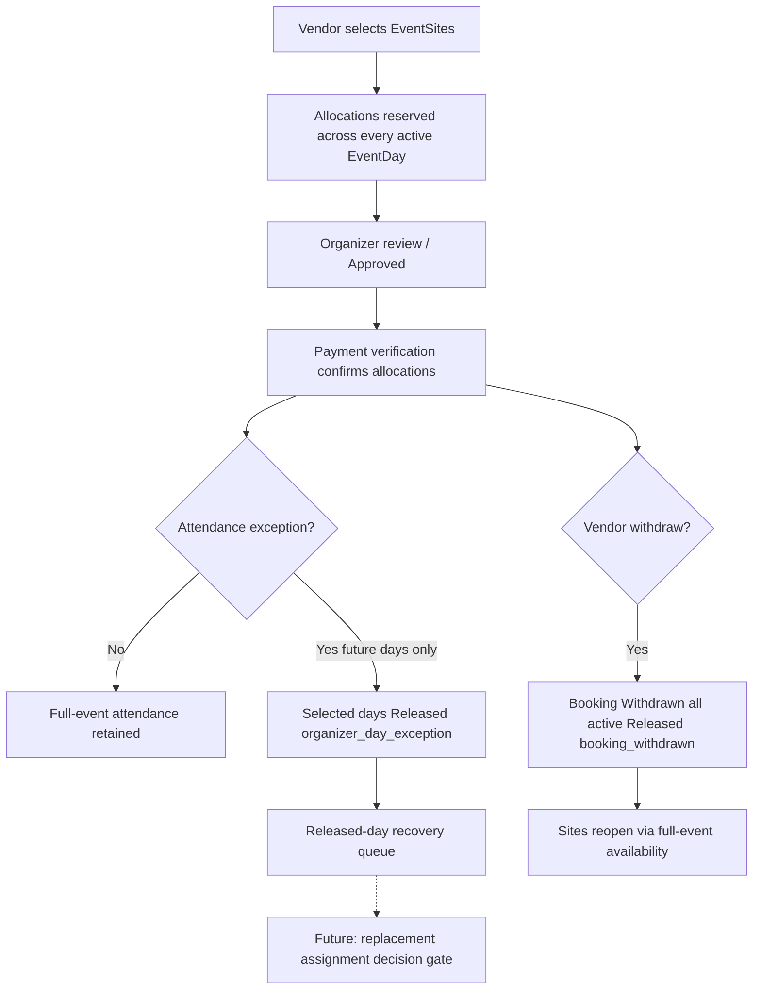

# Phase 2B Closure — Withdrawal, Reconciliation, Attendance Exception, and Released-Day Recovery

## Status

**Phase 2B is closed.**

Controlled slices 2B.1 through 2B.4 are complete, regression-verified, and documented. Replacement Vendor assignment was intentionally deferred.

## Slice summary

### Phase 2B.1 — Vendor withdrawal, no refund, allocation release

```text
Vendor withdraws
→ Booking becomes Withdrawn
→ active allocations become Released
→ sites reopen through full-event availability
→ payment and Invoice history remain preserved
→ no refund is created
```

### Phase 2B.2 — Organizer withdrawal reconciliation

```text
Organizer receives read-only withdrawal reconciliation
→ payment/no-refund interpretation
→ released-site summary
→ safe audit timeline
```

### Phase 2B.3 — Full-event attendance and Organizer day exception

```text
Vendor booking covers all EventDays by default
→ Organizer may reduce only future EventDay coverage
→ excluded day allocations become Released
→ retained day allocations remain active
→ Invoice amount and payment state remain unchanged
```

### Phase 2B.4 — Released-day recovery queue

```text
Organizer recovery queue identifies partial released EventDay/site slices
→ recovery-state derivation (recoverable / blocked / expired / unavailable)
→ standard full-event availability boundary preserved
→ operational hardening and readiness for later replacement assignment
```

## Canonical lifecycle



## Governance matrix

| Capability | community | organizer | super_admin | cmart_management |
| --- | :---: | :---: | :---: | :---: |
| Own booking create/withdraw | yes | no | no | no |
| Booking approve/reject/revise | no | yes | yes | no |
| Payment verification | no | yes | yes | no |
| Withdrawal reconciliation read | no | yes | yes | no |
| Attendance exception apply | no | yes | yes | no |
| Released-day recovery queue | no | yes | yes | no |
| Replacement assignment | deferred | deferred | deferred | deferred |

## Payment preservation rules

- Withdrawal never creates refunds.
- Attendance exceptions never change Invoice amount or payment status.
- Payment proof presence may be indicated; proof path is never exposed to Vendor or recovery queue consumers beyond existing Organizer invoice safety.

## Allocation transition matrix

| Trigger | From | To | `active_lock` | `release_reason` |
| --- | --- | --- | --- | --- |
| Create booking | — | reserved | 1 | — |
| Payment verify | reserved | confirmed | 1 | — |
| Withdraw | reserved/confirmed | released | null | `booking_withdrawn` |
| Cancel | reserved/confirmed | released | null | `booking_cancelled` |
| Reject | reserved/confirmed | released | null | `booking_rejected` |
| Attendance exception | reserved/confirmed | released | null | `organizer_day_exception` |

## Release-reason matrix

| Reason | Typical recovery channel |
| --- | --- |
| `booking_withdrawn` | `standard_full_event_availability` |
| `booking_cancelled` | `standard_full_event_availability` |
| `booking_rejected` | `standard_full_event_availability` |
| `organizer_day_exception` | `released_day_queue` when retained occupancy remains |

## Availability behavior

- Full release of all days for a site → site available for standard full-event booking.
- Partial day release with retained days → site remains unavailable for standard full-event booking.
- Released-day queue reports that distinction via `standard_full_event_available`.

## Deferred features

```text
replacement Vendor assignment
recovery acceptance
day-specific pricing
partial-event Invoice
partial refund / refund processing
day restoration / site swapping
waitlist
allocation expiration
CSV / PDF export
payment redesign
pass/check-in redesign
analytics
```

## Migrations introduced in Phase 2B

| Phase | Migration |
| --- | --- |
| 2B.3 | `2026_07_15_000001_create_booking_attendance_exceptions_tables.php` |
| 2B.4 | none (query-time derivation) |

Phase 2B.1 / 2B.2 used existing allocation and audit schema.

## Test totals (Phase 2B closure snapshot)

### Backend focused matrix

- `OrganizerReleasedDayRecoveryTest` — 8 passed / 75 assertions
- Phase 2B focused filters (`OrganizerAttendanceException`, `OrganizerWithdrawalReconciliation`, `BookingWithdrawalNoRefund`, `BookingAllocationLifecycle`, `VendorEventSiteAvailability`) — 55 passed / 397 assertions
- Expanded matrix (`BookingCreationWithAllocations`, reservation, history protection, governance, workflow, demo payment, staff summary) — 67 passed / 230 assertions

Exact full-suite totals are recorded in the validation report for the closure commit session.

### Frontend

- Unit suite including Phase 2B.1–2B.4 helpers — 48 passed
- Browser E2E:
  - withdrawal
  - attendance exception
  - released-day recovery (recoverable → partial → full blocked)

### Lint baseline

- Pre-existing unrelated oxlint errors: **12**
- Phase 2B.1–2B.4 targeted errors: **0**

## Persistent-data verification

E2E and feature cleanup restore baseline counts for operational tables. Shared Spaces catalogue is preserved. No truncate / migrate:fresh commands are used.

## Recommended next major phase

Do **not** auto-start it.

Preferred candidate after decision-gate approval:

```text
Replacement assignment for recoverable released-day slices
```

Only after product defines pricing, acceptance, payment obligation, Invoice ownership, and Organizer operational controls.

Alternate candidate if business prioritizes elsewhere:

```text
Phase 3 product stream (independent of allocation reassignment)
```
