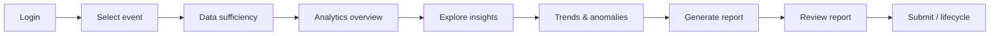

# 03 — Organizer User Flow

**Audit date:** 2026-07-28

Maps the **intended Organizer Analytics and Reporting Hub journey** against the **current implementation**. Status labels:

- **Complete** — end-to-end wired in source; organizer can perform action in UI with real API
- **Partially complete** — some steps exist but gaps remain
- **Disconnected** — code exists but not reachable or not linked to journey
- **Absent** — no implementation found
- **Blocked by missing data** — UI/API may exist but cannot produce correct results

**Login entry point:** Management login → `frontend/src/views/dashboards/AdminDashboard.vue` at `/admin` (organizer role). There is no separate `OrganizerDashboard` route.

---

## Journey overview

---

## Step 1 — Log in as organizer

| Field | Detail |
|-------|--------|
| **Expected action** | Authenticate with organizer credentials |
| **Current page / endpoint** | `frontend/src/views/auth/PublicLogin.vue` or management login → `POST /api/login` → redirect to `/admin` |
| **Required data** | `users.role` = `organizer` (or super_admin) |
| **Status** | **Complete** |
| **Evidence** | `frontend/src/stores/auth.js`, `AdminDashboard.vue`, `ManagementRole` |
| **Missing** | Dedicated organizer-branded landing (uses shared admin shell) |
| **Recommended destination** | Retain `/admin` shell; add hub section `#analytics-hub` in Phase 3 |

---

## Step 2 — Select an event

| Field | Detail |
|-------|--------|
| **Expected action** | Choose which carboot event to analyse |
| **Current page / endpoint** | **Report Centre only:** event picker via `GET /carboot-events` and `GET /cmart/report-events` in `OrganizerReportCentrePanel.vue` / `CMartReportCentrePanel.vue`. **Analytics panels:** no event selector |
| **Required data** | `carboot_events` rows |
| **Status** | **Partially complete** |
| **Evidence** | `OrganizerReportCentrePanel.vue`; `BossRevenuePanel.vue` has no event filter |
| **Missing** | Global event selector for analytics hub; recent-events shortcut |
| **Recommended destination** | Shared `EventAnalyticsContext` composable + event picker in new hub panel |

---

## Step 3 — Determine whether sufficient event data is available

| Field | Detail |
|-------|--------|
| **Expected action** | See completeness indicators before trusting metrics |
| **Current page / endpoint** | Implicit in `PostEventSummaryAggregator` → `data_availability` in snapshot; displayed in `PostEventSummaryView.vue` when viewing a generated report. No standalone pre-flight UI |
| **Required data** | Core tables: `bookings`, `invoices`, `event_sites`, `vendor_categories`; optional: `item_reservations`, `feedbacks.carboot_event_id` |
| **Status** | **Partially complete** |
| **Evidence** | `PostEventSummaryAggregator.php` lines 56–57, 89, 204–281; `PostEventSummaryView.vue` feedback unavailable message |
| **Missing** | Dedicated data-quality dashboard; CSV import status; survey response coverage % |
| **Blocked by missing data** | Feedback section always omitted until event linkage exists |
| **Recommended destination** | `GET /api/organizer/events/{id}/data-readiness` endpoint + hub UI card |

---

## Step 4 — View an analytics overview

| Field | Detail |
|-------|--------|
| **Expected action** | Event-level KPI summary (vendors, revenue, sites, feedback count) |
| **Current page / endpoint** | Fragmented: `#revenue` (`BossRevenuePanel`), `#bookings`, `#events`. Post-event snapshot sections only inside generated report preview |
| **Required data** | Event-scoped bookings, invoices, sites |
| **Status** | **Partially complete** |
| **Evidence** | `PostEventSummaryAggregator` produces overview sections; `BossRevenuePanel` is **global** |
| **Missing** | Unified event overview page; single KPI strip |
| **Recommended destination** | New `OrganizerEventAnalyticsPanel.vue` at `/admin#event-analytics` |

---

## Step 5 — Explore vendor, sales, participation, feedback, and sustainability insights

| Dimension | Current surface | Status | Notes |
|-----------|-----------------|--------|-------|
| **Vendor / categories** | Post-event snapshot `vendor_categories`; global `BossRevenuePanel` category chart | **Partially complete** | Event-scoped in report only |
| **Sales / payments** | Snapshot `payments`; global boss revenue; vendor `estimated_sales` | **Partially complete** | Invoice-based, not survey gross-sales bands |
| **Participation** | `feedbacks.participation_type`, `community_backgrounds` in DB; staff feedback panel | **Partially complete** | Not aggregated per event; no hub charts |
| **Feedback / satisfaction** | Public rating summary; word cloud; snapshot feedback (omitted) | **Blocked by missing data** | No `carboot_event_id` |
| **Sustainability / reuse** | `item_reservations` in snapshot; vendor reuse listings; `ImpactDashboard` mock | **Partially complete** | No event-level ESG; mock component orphaned |
| **Promotion / discovery** | — | **Absent** | No schema fields |
| **Operational issues** | Free-text `feedbacks.comments`; word cloud | **Partially complete** | Global word cloud only |

**Overall step 5 status:** **Partially complete** (fragmented; key dimensions missing or not event-scoped)

**Recommended destination:** Tabbed hub: Overview | Vendors | Economics | Feedback | Reuse | Operations

---

## Step 6 — Identify trends, anomalies, and actionable findings

| Field | Detail |
|-------|--------|
| **Expected action** | Compare events, spot outliers, surface recommendations |
| **Current page / endpoint** | `BossRevenuePanel` monthly-style charts (global); `BossWordCloudPanel` term frequencies; `BossAuditLogsPanel` approval trail. Vendor dashboard has monthly booking/payment trends (vendor-only) |
| **Required data** | Time-series per event; benchmark baselines |
| **Status** | **Absent** (for organizer event hub) |
| **Evidence** | No cross-event comparison UI; no anomaly rules; `advanced_analytics.py` broken |
| **Missing** | Event-over-event comparison; flagged anomalies; narrative suggestions |
| **Recommended destination** | Phase 2 Python aggregations + Phase 3 trend charts in hub |

---

## Step 7 — Generate an event-level report

| Field | Detail |
|-------|--------|
| **Expected action** | Create draft Post-Event Summary for selected event |
| **Current page / endpoint** | `OrganizerReportCentrePanel.vue` → `POST /api/organizer/generated-reports` |
| **Required data** | `carboot_event_id`, core operational tables |
| **Status** | **Partially complete** |
| **Evidence** | `ReportDraftService`, `OrganizerGeneratedReportController@store`, proactive or request-linked generation |
| **Missing** | Runtime validation in target environment; migrations may be unapplied |
| **Blocked by missing data** | Feedback metrics omitted from snapshot |
| **Recommended destination** | Retain existing workflow; add "Generate from hub" action |

---

## Step 8 — Review the generated report

| Field | Detail |
|-------|--------|
| **Expected action** | Preview snapshot, edit narratives, regenerate if needed |
| **Current page / endpoint** | `OrganizerReportCentrePanel.vue` → `GET /api/organizer/generated-reports/{id}`, `PostEventSummaryView.vue`, `PATCH narratives`, `POST regenerate` |
| **Required data** | `generated_reports.snapshot` JSON |
| **Status** | **Complete** (source-level) |
| **Evidence** | `OrganizerGeneratedReportController`, `PostEventSummaryView.vue` |
| **Missing** | PDF depends on DomPDF; feedback section shows unavailable note |
| **Recommended destination** | Enhance `PostEventSummaryView` as metrics improve |

---

## Step 9 — Submit, share, or manage report through Organizer-to-CMart lifecycle

| Field | Detail |
|-------|--------|
| **Expected action** | Publish to CMart; handle requests; revise; CMart views/downloads |
| **Current page / endpoint** | Organizer: `POST publish`, `POST revise`. CMart: `CMartReportCentrePanel.vue`, `POST mark-viewed`, PDF download. Request flow: CMart `POST /cmart/report-requests` → organizer acknowledge/decline |
| **Required data** | `report_requests`, `generated_reports`, `report_workflow_audits`, `notifications` |
| **Status** | **Partially complete** |
| **Evidence** | Full controller/service chain documented in `docs/generated-report-workflow-progress.md` |
| **Missing** | Real external notifications (simulated); notification inbox UI; workflow runtime validation |
| **Blocked by missing data** | N/A for lifecycle mechanics; DB tables must exist |
| **Recommended destination** | Phase 5 lifecycle hardening; optional real email in future scope |

---

## Journey readiness summary

| Step | Status |
|------|--------|
| 1. Login | **Complete** |
| 2. Select event | **Partially complete** |
| 3. Data sufficiency | **Partially complete** |
| 4. Analytics overview | **Partially complete** |
| 5. Explore insights | **Partially complete** / **Blocked** (feedback) |
| 6. Trends & anomalies | **Absent** |
| 7. Generate report | **Partially complete** |
| 8. Review report | **Complete** (source-level) |
| 9. Submit / lifecycle | **Partially complete** |

**Organizer-flow readiness (weighted):** ~**48%** — login and report review/publish machinery exist, but the analytics exploration path (steps 2–6) is not implemented as a cohesive hub.

---

## Intended vs current navigation map

| Intended hub section | Current equivalent |
|---------------------|-------------------|
| Event Analytics Hub | **Absent** — use `#revenue`, `#analytics`, `#report-centre` separately |
| Event selector | Report Centre only |
| Data readiness | Snapshot `data_availability` only |
| Survey / CSV management | **Absent** |
| Report Centre | `#report-centre` ✅ |
| CMart request inbox | `#report-centre` requests tab ✅ |
