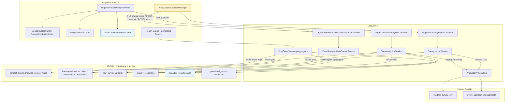
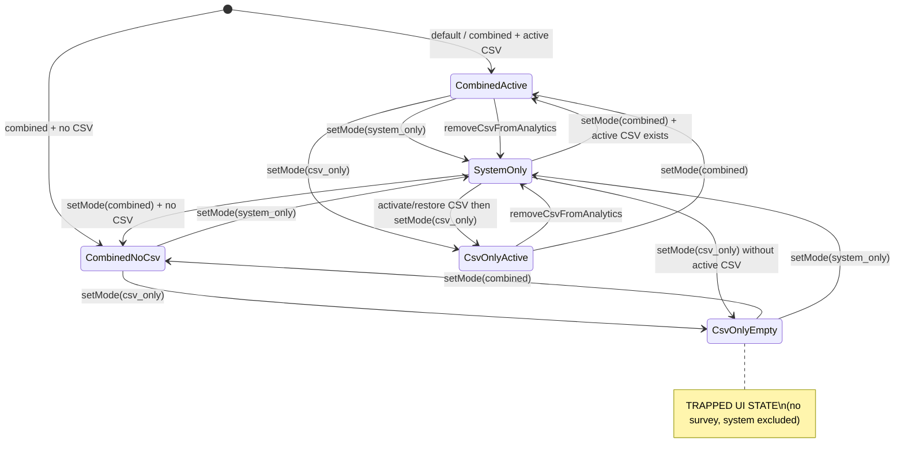

# 12 — Analytics Hub Deep Audit and Diagnosis

**Scope:** Read-only source diagnosis of the Organizer Analytics Hub.  
**Authority:** Current repository source (not prior report conclusions).  
**Constraint:** No application code, database, runtime service, migration, test, build, or browser change was performed for this audit.

---

## 1. Executive diagnosis

The Analytics Hub is an **event-scoped organizer workspace** that merges:

1. **System operational data** (bookings, invoices, sites, item reservations, event-linked community feedback) via Laravel aggregation (`EventAnalyticsService` + `PostEventSummaryAggregator`).
2. **CSV vendor post-event survey data** via import (`SurveyImportService` → `survey_responses`) and Python aggregation (`AnalyticsPythonClient` → FastAPI → cached `analytics_results`).
3. **Source-mode gating** (`carboot_events.analytics_source_mode`: `combined` | `system_only` | `csv_only`) shared conceptually with generated post-event reports.

The implementation became fragmented because several product layers were stacked quickly:

- survey import + dedup/provenance;
- Data Source Manager (modes, soft statuses, activate/exclude/archive/restore/undo);
- UI simplification that **removed Import History and recovery controls** while leaving backend recovery APIs;
- Overview redesign (revenue merged in);
- chart modernization on Vendors & Sales only;
- report aggregation that shares mode flags but **not** the same qualitative payload as the Hub.

| Problem class | What it means here | Example |
|---|---|---|
| **Architecture** | Competing truths about “source of record” and recovery | Duplicate checksum blocks re-upload; Remove keeps rows as `excluded`/`duplicate`; UI no longer exposes restore |
| **Workflow** | Organizer path is admin-first, not outcome-first | CSV upload lives under “Data Quality”; modes before onboarding |
| **UI / IA** | Labels and tabs describe implementation slices | “Data Quality”, “Comments & Word Cloud”, seven tabs |
| **Code defect** | Behaviour that violates an obvious contract | Q10/Q13 free text stored but never sent to Python / never shown; mode allows empty `csv_only` |

**Recoverability:** The system is **recoverable without a rewrite**. Core pipes (import → persist → Python aggregate → overview API → Vue tabs → report mode gating) are intact. What needs repair is the **source-state machine + recovery UX**, **qualitative text contract**, **empty/excluded semantics**, and **information architecture**—incrementally.

### Three most important root causes

1. **Incomplete CSV lifecycle in the UI vs backend** — Remove means soft-exclude + force `system_only`; duplicate protection still matches historical `duplicate`/`superseded`/`completed` checksum rows; activate/restore APIs exist but are unwired; organizers can still select empty `csv_only`.
2. **Survey free-text contract truncated at aggregation** — companion `*_other_text` columns are validated and stored, but `EventAnalyticsService` omits them when calling Python; aggregation only surfaces Q11 `comments_and_suggestions`.
3. **Source-mode and tab IA optimized for engineers, not organizer tasks** — modes gate both Hub and reports without guarding empty states; “Data Quality” hosts source administration; visualization names and survey-question groupings drive navigation.

---

## 2. Repository baseline

| Field | Value |
|---|---|
| Audit date | 2026-08-03 |
| Branch | `main` |
| HEAD commit | `7860fbc8468fb38b3a2461fd38a4f690df38d56e` — *Reorganize The Analytics Hub* |
| Tracking | `main...origin/main` (at audit time) |

### Relevant working-tree state (analytics-related; non-exhaustive)

Observed at audit time (source inspection only):

- Modified: `frontend/src/utils/analyticsLabels.js`, `frontend/src/views/dashboards/organizer/OrganizerEventAnalyticsPanel.vue`, `python_analytics/event_aggregations.py`, `python_analytics/survey_schema.py`
- Untracked: `frontend/src/components/analytics/SurveyDistributionChart.vue`, `VendorsSalesPanel.vue`, `frontend/src/utils/surveyChartConfig.js`
- Many older `report/*` paths show as deleted in `git status`; this audit does not treat those files as authority.

### Limitations of this source-only diagnosis

- **Runtime-unverified:** live DB row states, migration-applied flags, FastAPI process health, cache contents, and exact event-5 checksum sibling rows were not queried.
- **Observed symptoms** (e.g. HTTP 409 toast text, `csv_only` + no active CSV) are explained by **code paths that can produce them**; where multiple paths exist, they are listed explicitly.
- Credentials / `.env` were not read.

---

## 3. Current architecture map



**Legend**

- **Active:** Overview API, mode PUT, remove-from-analytics, survey import, Python validate/aggregate, report aggregator mode gating.
- **Optional / degraded:** `analytics_results` cache; community word-cloud side of Comments (Boss API, event-scoped when link ready).
- **Inconsistent:** UI Data Source Manager vs full backend batch lifecycle; Hub qualitative payload vs report survey summary; chart modernization only on Vendors tab.

---

## 4. Actual organizer journey

| Stage | Expected behaviour | Actual behaviour | Source evidence | Status | User impact |
|---|---|---|---|---|---|
| Open Organizer workspace | Land on Analytics Hub or clear nav | Hash `#event-analytics` → `OrganizerEventAnalyticsPanel`; legacy `#revenue` / `#analytics` redirected | `AdminDashboard.vue`, `workspaceNav` / `LEGACY_ANALYTICS_HASH_REDIRECTS` | Working | Can find Hub if nav known |
| Select event | Event-scoped analytics load | Event picker drives `getEventAnalyticsOverview(eventId)` | `OrganizerEventAnalyticsPanel.vue` `loadOverview` | Working | Correct scoping |
| Choose source mode | Clear include/exclude semantics; empty modes blocked or explained | Three buttons: Combined / System only / CSV only; **no guard** if CSV missing | `AnalyticsDataSourceManager.vue`; `EventAnalyticsDataSourceService::setSourceMode` | Contradictory | Empty Hub possible |
| Add survey CSV | Natural onboarding path | Upload under **Data Quality** tab via Current CSV Source | Panel tab `data-quality` + manager | Partially working | Feels technical / buried |
| Validate CSV | Python validates before persist | `SurveyImportService` calls `validateSurveyCsv` before store | `SurveyImportService::import` | Working | Good integrity |
| Duplicate same file | Clear recovery if excluded | 409 if any prior row with same SHA-256 in `completed|completed_with_errors|duplicate|superseded` **or** `is_active=true`; UI toast only | `SurveyImportService` lines 43–68; manager `uploadFile` | Dead end / Contradictory | Cannot re-add same file when sibling duplicate exists; no UI restore |
| Replace CSV | Confirm + replace | 409 `survey_import_replace_required` or confirm replace flow | Controller + manager | Working | OK when different file |
| Remove CSV | Detach from analytics with recovery | Soft `excluded`, deactivate responses, force `system_only`; raw kept | `removeCsvFromAnalytics` | Partially working | Recovery APIs unused in UI |
| View Overview | Meaningful KPIs with state labels | Can show dashes / zeros / excluded without distinguishing causes | Overview template + `buildKpis` | Contradictory | Misleading emptiness |
| View survey charts | Consistent visuals | Vendors: Chart.js suite; Items/Experience: `AnalyticsBarList` | Panel + `VendorsSalesPanel` | Partially working | Visual inconsistency |
| View comments | All substantive free text | Only Q11 items from Python; Q10/Q13 text omitted upstream | `EventAnalyticsService` `only([...])`; Python comments loop | Defect | “No comments” while text exists |
| Generate report | Matches Hub source intent | Aggregator uses same mode include flags; survey summary is thin (bands/ratings only, no comment list) | `PostEventSummaryAggregator` | Partially working | Hub/report qualitative mismatch |
| Re-enable CSV | Visible recovery | Backend `activate`/`restore`/`undo` routes exist; **Vue does not call them** | `api.php` routes; manager imports only upload/setMode/remove | Dead end | Organizer trapped without API/history |

---

## 5. Current data-source model

### System operational data

| Area | Origin | Hub usage |
|---|---|---|
| Booking pipeline | Bookings for event | Counts (approved etc.) when mode includes system |
| Payments / invoices | Invoice aggregates | Expected / collected / outstanding; paid/unpaid counts |
| Event sites | Event site records | Operations tab |
| Item reservations | Reservation counts | Operations tab |
| Community feedback | `feedbacks` with event link when ready | Feedback summary + Comments tab themes (Boss wordcloud scoped) |

Gated by `includeSystem` when mode ∈ `{combined, system_only}` in `EventAnalyticsService::overview`.

### CSV survey data

| State | Meaning in code |
|---|---|
| Active batch | `is_active` / current active helper; responses `forAnalytics` |
| Excluded | `status = excluded`, responses inactive; kept for metadata |
| Duplicate | Same checksum twin; `status = duplicate`, `duplicate_of_id` set |
| Superseded | Replaced by newer different-file import |
| Archived | Soft archive status for recovery path |

Submission provenance: `submission_source` (`csv_import` default; `system_submission` modelled on `SurveyResponse`).

### Future direct vendor submission

**Partially modelled, not productized.**

- Constants: `SurveyResponse::SOURCE_SYSTEM_SUBMISSION`, nullable `import_batch_id`, `vendor_user_id`, `active_system_key`.
- `SurveyResponse::scopeForAnalytics` can include system submissions alongside active CSV.
- No organizer UI or vendor submission API for post-event survey forms was found as a live Hub onboarding path.

### Python analytics results

Python is a **processor + cache producer**, not the system of record:

1. Validate CSV → normalized records.
2. Aggregate active response arrays from Laravel → distribution + Q11 comments.
3. Payload stored in `analytics_results` keyed by event + metric + calculation version + fingerprint.

### Generated-report snapshots

`PostEventSummaryAggregator` builds live aggregates at draft/regenerate time into generated-report payload. Published snapshots are intended to be immutable thereafter. They honour `analytics_source_mode` include flags but use a **narrower survey summary** (counts of bands/ratings/purpose) without Hub qualitative lists.

---

## 6. Source-mode state-machine diagnosis



| State | Available data | Displayed metrics | Allowed actions (UI) | Current behaviour | Intended behaviour (inferred) | Recoverable in UI? |
|---|---|---|---|---|---|---|
| Combined + active CSV | System + survey | Full Hub | Mode change, replace, remove | Working path | Primary path | Yes |
| Combined + no CSV | System only; survey empty/unavailable | Ops KPIs; survey empty | Upload, mode change | Working | OK | Yes |
| System only | System; survey excluded message | Ops; survey KPIs excluded/0 | Mode change, upload (file still importable) | Working | OK | Yes |
| CSV only + active CSV | Survey; system excluded | Survey charts; ops excluded | Mode, replace, remove | Working | OK | Yes |
| **CSV only + excluded/no CSV** | Neither useful source | Dashes / zeros / excluded | Mode change, Upload (may 409) | **Trapped / empty** | Should block or auto-fallback | **Partial** (can switch mode; may not re-upload same file) |
| Duplicate upload | No new rows | Toast 409 | None for that file | Checksum match | Protect integrity | No reactivation in UI |
| Replacement | New active; prior superseded | Refreshed survey | Confirm replace | Working | OK | Yes |
| Removal | Soft exclude + `system_only` | System path | No restore button | Backend recoverable | Soft detach with undo | **No** |
| Reactivation | Would restore survey | — | Not in Vue | API only | Soft undo | **No** |
| Report generation | Follows mode flags | Snapshot | Report Centre | Mode-aligned ops/survey include; thin survey | Match Hub intent | N/A |

### Confirmed trapped-state diagnosis (Symptom 1)

Observed combination: **`csv_only` + System excluded + no active CSV + 409 on same file + no recovery controls.**

**Cause chain (code-accurate):**

1. **Remove** (`EventAnalyticsDataSourceService::removeCsvFromAnalytics`) sets active batch to `STATUS_EXCLUDED`, deactivates responses, keeps raw metadata, and forces mode to **`system_only`** — not `csv_only`.
2. **Empty `csv_only`** therefore requires a **subsequent** `setSourceMode(..., csv_only)` (UI allows this with **no active-batch check**).
3. **409 duplicate** is thrown when *any* prior `raw_survey_uploads` row for the event+schema+SHA-256 matches:
   - `status ∈ {completed, completed_with_errors, duplicate, superseded}` **OR**
   - `is_active = true`  
   Note: **`excluded` alone is not in the status list.** A *single* excluded row with `is_active=false` should **not** 409.
4. Therefore the observed 409 after remove almost certainly means **another checksum twin still exists** with status `duplicate` / `superseded` / `completed` (consistent with historical double-import / dedup backfill), **or** some other non-excluded matching row remains.
5. UI recovery was removed: Import History, Undo, Restore, Activate are **not** bound in `AnalyticsDataSourceManager.vue` (only `uploadSurveyImport`, `setAnalyticsSourceMode`, `removeCsvFromAnalytics`). Backend routes for activate/exclude/archive/restore/undo **still exist** in `backend/routes/api.php`.

**Verdict:** Duplicate 409 is **technically correct** for checksum twin protection; it is **functionally wrong for organizers** when the only intended dataset is soft-excluded and UI cannot activate/restore. Combined with unrestricted `csv_only`, this creates a **workflow dead end**, not a single-line bug.

---

## 7. CSV lifecycle diagnosis

```text
Select file → upload → checksum → duplicate check → Python validation
→ normalization → persistence → activation → aggregation → display
→ replacement / removal
```

| Transition | Frontend | Endpoint | Controller | Service | Model state | Error / UI |
|---|---|---|---|---|---|---|
| Select file | `openReplace` / `onFileChange` | — | — | — | — | Hidden file input |
| Upload | `uploadSurveyImport` | `POST /organizer/events/{event}/survey-imports` | `OrganizerSurveyImportController::store` | `SurveyImportService::import` | New `pending`→completed batch; responses inserted | 201 + overview |
| Checksum | — | — | — | `hash_file('sha256', …)` | `sha256` on batch | — |
| Duplicate check | Toast on 409 | same | catches `DuplicateSurveyImportException` | Query by event+schema+sha256+status/is_active | No write | 409 `survey_import_duplicate` |
| Replace required | Confirm modal | same | `SurveyReplacementRequiredException` | Active batch exists, `replace_existing=false` | Unchanged | 409 `survey_import_replace_required` |
| Python validation | — | via client | — | `python->validateSurveyCsv` | — | 422/502 paths |
| Persistence | — | — | — | Store file + create responses | `raw_survey_uploads`, `survey_responses` | — |
| Activation | Implicit on successful import/replace | — | — | Import/activate paths set `is_active` | One active batch | — |
| Aggregation | Overview refresh | `GET .../analytics/overview` | `OrganizerEventAnalyticsController` | `EventAnalyticsService::surveyBundle` → Python | `analytics_results` | Degraded if Python fails |
| Display | Tabs bind survey sections | — | — | — | — | Charts / bars / comments |
| Remove | `removeCsvFromAnalytics` | `POST .../survey-imports/remove-from-analytics` | `OrganizerEventAnalyticsDataSourceController::removeCsv` | `removeCsvFromAnalytics` | `excluded`, inactive responses, mode `system_only` | Success toast |
| Activate / restore / undo | **Not wired** | POST activate/restore/undo | DataSource controller | `activateBatch` / `restore` / `undo` | Would re-activate | Unavailable in UI |

### Remove semantics

| Question | Answer from code |
|---|---|
| What does Remove mean today? | **Soft exclude** from analytics + deactivate responses + switch mode to system_only; **not** hard delete |
| Delete? | No — storage path and metadata retained |
| Archive? | Separate `archiveBatch` API; not the Remove button |
| Detach? | Effectively yes (from analytics), with mode reset |
| Reactivation? | Yes in backend (`activate`/`restore`); **no** in current Vue |
| Why 409 is technically correct | Prevents double-counting same file bytes under completed/duplicate/superseded history |
| Why 409 is functionally wrong when excluded | Organizer intent is “I removed it; let me use this file again”; excluded primary is ignored, but **twin rows still block**; UI offers no activate of excluded batch |

---

## 8. Information architecture and tab audit

Current tabs (`OrganizerEventAnalyticsPanel.vue`):

| Current tab | Actual contents | Organizer question answered | Overlap | Naming verdict | Recommended action |
|---|---|---|---|---|---|
| Overview | Event header, source pills, KPIs, finance, categories, survey snapshot, CTAs | “How is this event doing overall?” | Overlaps Revenue (merged) and survey teaser | Keep name | Keep |
| Vendors & Sales | Q1 categories, purpose, gross sales, items sold (Chart.js) | “What did vendors sell / earn (self-report)?” | Mixes identity + economics | OK-ish; dense | Rename or split later |
| Items & Reuse | Conditions, unsold actions, circularity-ish bars | “What happened to unsold / used goods?” | Overlaps Vendors economics | Acceptable | Keep or merge into Survey |
| Experience | Rating, improvements, info sources, supporting activity | “How was the experience / what to improve?” | Overlaps Comments | Vague | Rename |
| Operations | Sites, reservations, pipeline ops | “Is operations healthy?” | Distinct from survey | Clear | Keep |
| Data Quality | **Data Source Manager** (modes + CSV upload/remove) | “Which data powers analytics?” | Misnamed; not DQ analysis | Misleading | Move / Rename |
| Comments & Word Cloud | Community themes, product themes, Q11 comments | “What are people saying?” | Viz name as nav | Poor | Rename |

### Alternative A (preferred) — 5 tabs

1. **Overview** — KPIs + finance + readiness + source status summary  
2. **Survey results** — all vendor survey distributions (current Vendors/Items/Experience content)  
3. **Vendor comments** — qualitative text (Q11 + other free text), themes as secondary  
4. **Operations** — system operational metrics  
5. **Data sources** — modes + CSV onboarding/replace/remove/recover  

Why preferred: organizer language, fewer tabs, CSV onboarding has a home, separates ops vs survey without seven competing labels.

### Alternative B — 4 tabs

1. **Overview** (includes light ops finance)  
2. **Vendor feedback** (survey + comments)  
3. **Bookings & operations**  
4. **Data sources**  

Slightly more merge pressure on survey density; still better than seven.

---

## 9. Overview diagnosis

| Element | Assessment |
|---|---|
| Event header | Meaningful |
| Source badges / pills | Meaningful but jargon-heavy; excluded vs empty not always distinct |
| Respondent KPI | Meaningful when survey included; **0 / — when excluded or no CSV** can look like “no vendors answered” | Misleading if mode-excluded |
| Booking KPI | Meaningful for system mode; excluded under csv_only | Correct but poorly explained when dashed |
| Expected / collected / outstanding revenue | Operational invoice math; not survey sales | Technically correct; easy to confuse with Q6/Q7 bands |
| Collection rate | Derived; `—` when expected=0 | Ambiguous empty |
| Financial performance bar | Useful when invoices exist | Misleading at zero without “no invoices” copy |
| Booking categories | System booking categories | Correct; not survey product categories |
| Survey snapshot | Teaser into Vendors tab | Redundant if empty |
| CTAs (bookings / vendors) | Helpful when data exists | Dead when sources excluded |

### Recommended Overview hierarchy (design only)

1. Event identity + **plain-language source status** (what is included / why empty).  
2. Primary outcome row: respondents (survey) vs approved vendors (ops) — **never mixed**.  
3. Finance (system only) with explicit “excluded by mode” state.  
4. One survey highlight + one ops highlight.  
5. Single CTA: Add survey data **or** Open bookings — based on readiness.

---

## 10. Metric and data-lineage catalogue

Abbreviations: **Ops** = system DB; **CSV** = survey_responses via import; **Py** = Python aggregate; **Rpt** = PostEventSummaryAggregator.

| Metric | UI location | Source type | Source field/table | Calculation | Filter | Empty-state meaning | Report usage | Status |
|---|---|---|---|---|---|---|---|---|
| Survey respondent count | Overview KPI, badges | CSV (+ future system_submission) | `survey_responses` via `forAnalytics` | Count active analytics rows | Mode includeSurvey; active/dedup scope | 0 = none active **or** excluded mode shows 0 | `respondent_count` in vendor_survey | Working (do not mix bookings) |
| Approved bookings | Overview / Ops | Ops | bookings | Pipeline approved_count | includeSystem | 0 vs excluded | booking_pipeline | Working |
| Expected revenue | Overview finance | Ops | invoices | Sum expected | includeSystem | 0 vs no invoices vs excluded | payments | Working |
| Collected / outstanding | Overview | Ops | invoices | Paid vs unpaid amounts | includeSystem | Same ambiguity | payments | Working |
| Paid/unpaid invoice counts | Overview finance toggle | Ops | invoices | Counts | includeSystem | 0 vs excluded | partial | Working |
| Collection rate | Overview | Ops derived | expected/collected | Ratio | expected>0 else — | — ≠ zero | not primary | Working |
| Q1 product categories | Vendors | CSV→Py | `product_categories` | Multi-select distribution | forAnalytics | No selections | not full dist in Rpt | Working charts |
| Q1 other text | — | CSV stored | `product_categories_other_text` | — | — | Not shown | No | Missing in Hub |
| Q2 item conditions | Items | CSV→Py | `item_conditions` | Distribution | forAnalytics | Empty bars | No | Working bars |
| Q3 difficulty | Experience | CSV→Py | `has_difficulty`, `difficulty_details` | Counts + details field exists | forAnalytics | Details not surfaced in Comments | No | Partial |
| Q4 info sources | Experience | CSV→Py | `event_info_sources` | Distribution | forAnalytics | Empty | No | Working bars |
| Q4 other text | — | CSV stored | `event_info_sources_other_text` | — | — | Not shown | No | Missing in Hub |
| Q5 items sold band | Vendors | CSV→Py | `items_sold_band` | Ordered bands | forAnalytics | Unanswered count | No full | Working charts |
| Q6/Q7 gross sales band | Vendors | CSV→Py | `gross_sales_band` | Ordered bands (**not RM**) | forAnalytics | Unanswered | Rpt band counts | Working |
| Q8 unsold actions | Items | CSV→Py | `unsold_item_actions` | Multi-select | forAnalytics | Empty | No | Working bars |
| Q9 sales purpose | Vendors | CSV→Py | `sales_purpose` | Single choice | forAnalytics | Unanswered | Rpt counts | Working |
| Q9 experience rating | Experience | CSV→Py | `experience_rating` | Distribution | forAnalytics | Empty | Rpt counts | Working |
| Q10 improvement areas | Experience | CSV→Py | `improvement_areas` | Multi-select codes | forAnalytics | Empty | No | Working bars |
| Q10 other text | — | CSV stored | `improvement_areas_other_text` ← `q10_lain_lain_teks` | Validated in Python | Persisted in import | **Not sent to Py aggregate; not displayed** | No | **Defect** |
| Q11 comments | Comments | CSV→Py | `comments_and_suggestions` ← `q11_komen_cadangan` | Strip; drop `tiada` | forAnalytics | Empty list | Not in Rpt survey summary | Working if substantive |
| Q12 supporting attracted | Experience | CSV→Py | `supporting_activity_attracted_visitors` | Distribution | forAnalytics | Empty | No | Working |
| Q13 impacts | Experience | CSV→Py | `supporting_activity_impacts` | Multi-select | forAnalytics | Empty | No | Working bars |
| Q13 other text | — | CSV stored | `supporting_activity_impacts_other_text` ← `q13_lain_lain_teks` | Validated | Persisted | **Not sent / not displayed** | No | **Defect** |
| Community feedback count | Comments / readiness | Ops | `feedbacks` | Event-linked | link ready | Unlinked vs zero | feedback summary | Partial |
| Vendor product description themes | Comments | Ops | booking product text via Boss wordcloud | Term weights | approved | Empty message | No | Partial / global API reused |
| Future system survey count | Model only | system_submission | `submission_source` | forAnalytics union | — | N/A | Anticipated | Partial model |

**Hard rule already intended in copy:** survey `n` must never include bookings/invoices — Hub mode hint states this; `buildKpis` keeps separate KPI entries.

---

## 11. Qualitative-text diagnosis

| Field | CSV header | Validated | Normalized | Stored | Aggregated | Displayed | In reports | Non-substantive handling |
|---|---|---|---|---|---|---|---|---|
| Q1 other | product other col | Yes | Yes | `product_categories_other_text` | No | No | No | — |
| Q3 details | difficulty text | Yes | Yes | `difficulty_details` | Passed to Py but not listed in comments | No dedicated UI | No | — |
| Q4 other | info other | Yes | Yes | `event_info_sources_other_text` | No (omitted in `only`) | No | No | — |
| Q10 other | `q10_lain_lain_teks` | Yes | `improvement_areas_other_text` | Yes | **No** | **No** | No | — |
| Q11 | `q11_komen_cadangan` | Yes | `comments_and_suggestions` | Yes | Yes | Comments list | No list in aggregator | Filters exact `tiada` |
| Q13 other | `q13_lain_lain_teks` | Yes | `supporting_activity_impacts_other_text` | Yes | **No** | **No** | No | — |
| Community feedback | feedback body | App path | — | `feedbacks` | Wordcloud API | Themes panel | Feedback aggregates | Hidden feedback excluded |
| Vendor product descriptions | booking fields | — | — | bookings | Boss products wordcloud | Themes panel | No | — |

### Why Q10/Q13 text is absent (exact chain)

1. `python_analytics/validate_survey_csv.py` reads `q10_lain_lain_teks` / `q13_lain_lain_teks` into normalized keys.  
2. `SurveyImportService` persists `improvement_areas_other_text` and `supporting_activity_impacts_other_text`.  
3. `EventAnalyticsService::surveyBundle` maps records with `$row->only([..., 'improvement_areas', 'comments_and_suggestions', 'supporting_activity_impacts', ...])` — **omits all `*_other_text` fields**.  
4. `event_aggregations.py` builds `comments` **only** from `comments_and_suggestions`, dropping `tiada`.  
5. Vue `surveyComments` reads `overview.survey.sections.experience.comments_and_suggestions.items` only.

When Q11 is mostly `Tiada` but Q10/Q13 contain suggestions, Comments correctly shows **no Q11 items** and incorrectly implies **no vendor free text exists**.

### Recommended small-n qualitative approach (no ML sentiment)

1. Show **original comments** grouped by question (Q11, Q10 other, Q13 other, Q3 details).  
2. Descriptive **theme chips** from coded multi-selects (already available as distributions).  
3. Optional keyword frequency only if term count ≥ small threshold; hide Word Cloud when tokens ≪ useful.  
4. Label actionable suggestions explicitly (improvement other text).  
5. Do **not** run sentiment models at n≈9.

---

## 12. Visualization diagnosis

| Metric | Data type | Current visual | Appropriate? | Recommended visual | Interaction | Small-n limitation |
|---|---|---|---|---|---|---|
| Q1 categories | Multi-select counts | Lollipop horizontal (`SurveyDistributionChart`) | Yes for ranked multi-select | Keep lollipop or simple bars | Count/% toggle | Percents unstable |
| Sales purpose | Single choice | Stacked horizontal | Borderline for n=9 | Ordered bars + unanswered | Count/% | Stacked implies precision |
| Gross sales bands | Ordered categories | Vertical columns | Yes | Keep columns | Count/% | Band ≠ RM |
| Items sold bands | Ordered categories | Chart in Vendors panel | Yes | Keep | Count/% | Same |
| Item conditions / unsold / improvements / impacts | Multi-select | `AnalyticsBarList` progress bars | Acceptable | Unify with shared chart kit later | None | Bars OK |
| Experience rating | Ordinal | Bar list | Yes | Ordered bars | None | Fine |
| Word cloud | Terms | Sized spans | Weak at small n | Prefer list | None | Misleading prominence |
| Finance split | Amounts/counts | Segment bar on Overview | Yes | Keep with state labels | Amount/count toggle | — |

**Ownership:** Python should own **counts, order, unanswered**; Vue should own **rendering**. Chart.js components must consume `{label, count, percent}` (+ unanswered) — Vendors path aligns with recent Python codebook ordering; other tabs still use older bar lists.

**Progress bars:** Still rendered on Items, Experience, Operations category lists — not removed; coexistence causes visual inconsistency, not breakage.

---

## 13. Empty, error and excluded-state diagnosis

| State | Current message / display | Recommended meaning |
|---|---|---|
| Legitimate zero | Often `0` or empty chart | “Zero recorded for this metric” |
| Unavailable | `unavailable_metrics`, degraded survey | “Could not compute (service/schema)” |
| Excluded by mode | Survey/ops bundle `status: excluded` + message | “Hidden because of source mode — data still stored” |
| No active CSV | “No active CSV survey is included…” | Same + offer Upload **or** Reactivate if excluded exists |
| Failed import | 422/502 toasts | Show validation errors |
| Duplicate upload | Info toast: already imported; no responses added | If excluded twin: offer Reactivate; else explain duplicate protection |
| Python unavailable | Degraded survey / 502 import | Banner: analytics engine unreachable |
| Missing migration | 503 survey tables / mode RuntimeException | Admin: apply migrations |
| No bookings | 0 approved | “No approved bookings yet” ≠ excluded |
| No feedback | Empty themes | Distinguish unlinked vs none |
| Unanswered survey question | unanswered counts on some charts | “X of n did not answer” |
| Dash `—` | Used widely when null/zero expected | Replace with explicit state strings |

Dashes currently collapse **excluded**, **missing**, and **zero** into one glyph — primary empty-state defect.

---

## 14. Generated-report consistency

| Concern | Hub | Report aggregator | Match? |
|---|---|---|---|
| Source mode | `EventAnalyticsService` include flags | Same mode include flags | Yes |
| Active responses | `SurveyResponse::forAnalytics` | Same scope for survey summary | Yes for counts |
| Removed/superseded CSV | Inactive excluded from forAnalytics | Same | Yes |
| Immutable old snapshots | N/A live | Published payload frozen | Intentional diverge from live Hub |
| New snapshot | Live overview | Regenerated aggregate | Mode-aligned |
| Provenance | data_sources / import metadata | data_availability notes | Partial |
| Respondent count | survey.respondent_count | vendor_survey.respondent_count | Aligned when included |
| Qualitative text | Q11 list (incomplete) | **Not included** in vendor_survey summary | **Mismatch** |
| Unavailable metrics | overview.unavailable_metrics | data_availability empty/omitted/excluded | Partial vocabulary |

**Hub/report mismatches to expect:** qualitative depth; chart-level distributions vs thin band counts; Overview finance narrative vs report section packaging; live mode changes do not rewrite published snapshots.

---

## 15. Authorization and privacy

| Question | Finding |
|---|---|
| Who changes source mode? | Organizer-equivalent roles (`ManagementRole::organizerEquivalentRoles`) via PUT source-mode |
| Who uploads/removes CSV? | Same middleware group on survey-import routes |
| Who views raw comments? | Organizers via Hub Comments (Q11 texts in overview payload) |
| Can CMart access raw analytics Hub? | Hub routes are organizer-equivalent group; CMart has separate generated-report routes — not the same Hub API |
| Can vendors see others’ survey responses? | Vendor analytics routes are separate (`/vendor/analytics/*`); event Hub is not vendor-facing |
| Raw file paths exposed? | `RawSurveyUploadResource` exposes metadata; storage is local disk — confirm resource does not leak full server paths to clients (resource fields are filename-oriented; storage_path not emphasized in UI) |
| CSV free text rendering? | Vue interpolates comment text as text nodes (not `v-html`) in `EventCommentsWordCloud` — generally safe XSS posture |

---

## 16. Legacy and duplication inventory

| Module | Caller / route | Role | Status | Overlap with Hub | Removal risk |
|---|---|---|---|---|---|
| Organizer Analytics Hub | `#event-analytics` | Organizer / super_admin | **Active connected** | Canonical | Keep |
| Boss Revenue panel | Boss analytics revenue API | Boss/admin | **Active global** | Overlaps event finance conceptually | Keep; different scope |
| Boss Word Cloud | `/boss/analytics/wordcloud/{source}` | Boss; also reused by event comments | **Active**; partially reused | Themes in Comments tab | Keep; clarify event scope |
| Vendor Analytics | Vendor dashboard | Vendor | **Active** | Different audience | Keep |
| Report Centre / Generated reports | Organizer report routes | Organizer | **Active connected** | Shares mode + survey counts | Keep; reconcile payloads |
| Legacy `#revenue` / `#analytics` hashes | Redirect into Hub | Organizer | **Redirected** | Compatibility | Keep redirects |
| `AnalyticsBarList` | Items/Experience/Ops | Organizer Hub | **Active** | Overlaps new charts | Keep until unified |
| `VendorsSalesPanel` + Chart.js | Vendors tab | Organizer | **Active** (may be uncommitted) | New path | Keep |
| Data source activate/restore/undo APIs | Not called by Vue | Organizer API | **Connected backend / disconnected UI** | Recovery | Do not delete |
| Import history in overview JSON | Still returned by `importHistory()` | API | **Payload present / UI removed** | Recovery | Do not delete API yet |
| Blade `/analytics` web + proxy | `web.php` | Legacy | Likely residual | Unknown overlap | Audit before delete |
| Hard-coded impact prototypes | Historical | — | Treat as superseded if unused | — | Evidence before delete |

---

## 17. Root-cause register

| ID | Category | Problem | Exact evidence | Root cause | User impact | Severity | Recommended decision |
|---|---|---|---|---|---|---|---|
| RC-01 | State-machine conflict | Empty `csv_only` allowed | `setSourceMode` no active-CSV guard; UI mode buttons | Mode treated as free preference | Blank Hub | Critical | Block or auto-fallback |
| RC-02 | Defect / Missing functionality | No UI recovery after Remove | Manager only wires upload/mode/remove; history UI removed | UI simplification without replacement | Dead end | Critical | Restore recovery or redefine Remove |
| RC-03 | State-machine conflict | 409 after exclude when twin exists | Duplicate query includes `duplicate`/`superseded` statuses | Dedup + soft-exclude not coordinated for re-entry | Cannot re-upload same file | Critical | Decide: reactivate vs allow re-import of excluded checksum |
| RC-04 | Data contract | Q10/Q13 text dropped | `EventAnalyticsService` `only([...])` omits `*_other_text` | Aggregation contract incomplete | “No comments” false | High | Extend payload + UI grouping |
| RC-05 | Information architecture | CSV under Data Quality | Tab id `data-quality` hosts `AnalyticsDataSourceManager` | Admin metaphor | Upload feels disconnected | High | Move to Data sources / onboarding |
| RC-06 | Naming | Comments & Word Cloud | Tab label + mixed Boss themes | Viz-led IA | Cognitive load | Medium | Rename |
| RC-07 | Empty state | Dashes conflate states | Overview KPIs / finance | No state taxonomy in UI | Misleading zeros | High | Explicit empty taxonomy |
| RC-08 | Visualization | Split chart systems | Vendors Chart.js vs AnalyticsBarList elsewhere | Incremental UI | Inconsistent trust | Medium | Unify gradually |
| RC-09 | Report inconsistency | No qualitative in report survey summary | `vendorSurveySummary` selects only band/rating/purpose | Aggregator scope too narrow | Hub≠report story | Medium | Align fields intentionally |
| RC-10 | Legacy overlap | Recovery APIs orphaned | Routes present; Vue absent | Incomplete cleanup | Hidden capability | High | Re-expose or formally deprecate |
| RC-11 | Missing functionality | Direct vendor survey submission | Model constants only | Future-proofing incomplete | Anticipation confusion | Low–Medium | Product decision |
| RC-12 | Naming | Experience / Vendors & Sales | Multi-question dumps | Schema-led tabs | Vague tasks | Medium | Restructure tabs |

---

## 18. Recommended recovery sequence

1. **Lock product decisions** (Section 19) — especially Remove meaning, reactivation, default mode, Hub↔report relationship.  
2. **Repair source-state transitions** — forbid or auto-correct empty `csv_only`; define transitions after Remove.  
3. **Repair CSV recovery** — either re-wire activate/restore/history **or** change duplicate rule for fully excluded checksums; never leave 409 without a next action.  
4. **Lock information architecture** — adopt preferred tab structure; move CSV onboarding.  
5. **Repair metric contracts** — empty taxonomy; KPI labelling for excluded vs zero.  
6. **Repair qualitative-text mapping** — include `*_other_text` + difficulty details in Python + Comments UI.  
7. **Redesign visual hierarchy** — unify chart kit; tone down word cloud at small n.  
8. **Reconcile generated reports** — decide which Hub fields must appear in new snapshots.  
9. **Remove legacy UI only after replacement verified** — keep redirects and Boss global tools until confirmed unused.

Each step requires the matching stakeholder answers before coding resumes.

---

## 19. Decision questions for stakeholder review

Answer in order. Do not implement until answered.

### Q1 — Default data source
**Decision:** What should a new/finished event use by default?  
**Options:** (A) Combined (B) System only until CSV added (C) CSV only  
**Recommended:** (B) System only until first successful survey import, then offer Combined.  
**Impact:** A can show empty survey forever; C creates empty Hub; B matches ops-first organizers.

### Q2 — Meaning of Remove CSV
**Decision:** What should Remove do?  
**Options:** (A) Soft exclude + keep file for dedup (current backend) (B) Soft exclude + allow same-file re-import (C) Hard delete file+rows  
**Recommended:** (A) or (B) with explicit label “Exclude from analytics”; avoid (C) for audit.  
**Impact:** Determines 409 policy and recovery UX.

### Q3 — CSV recovery / reactivation
**Decision:** After exclude, how does the organizer recover?  
**Options:** (A) Reactivate excluded batch (B) Re-upload same file allowed (C) Only upload a new file  
**Recommended:** (A) primary, with (B) as alternative if product wants simpler mental model.  
**Impact:** Fixes Symptom 1; requires UI for history/activate.

### Q4 — CSV upload placement
**Decision:** Where does upload live?  
**Options:** (A) Stay under Data Quality (B) Dedicated Data sources tab (C) First-run Overview CTA / wizard  
**Recommended:** (B) + Overview CTA when missing.  
**Impact:** Fixes disconnected upload feel.

### Q5 — Final tab structure
**Decision:** Which IA?  
**Options:** (A) Preferred 5-tab (B) 4-tab (C) Keep 7 with renames only  
**Recommended:** (A).  
**Impact:** Cognitive load and onboarding clarity.

### Q6 — Hub vs generated report
**Decision:** Must new report drafts mirror Hub source mode and qualitative depth?  
**Options:** (A) Full mirror (B) Mode + KPIs only (C) Independent report questionnaire  
**Recommended:** (A) for mode + respondent + qualitative lists; charts can remain summarized.  
**Impact:** Trust between Hub and Report Centre.

### Q7 — Future direct vendor submissions
**Decision:** In scope for near-term Hub?  
**Options:** (A) Build soon (B) Keep model only, hide from UI copy (C) Drop from analytics scope language  
**Recommended:** (B) until API exists.  
**Impact:** Avoids promising Combined “system survey” that cannot be collected.

### Q8 — Qualitative comments / themes
**Decision:** What appears in Comments for small n?  
**Options:** (A) Original texts by question (B) Coded themes only (C) Word cloud primary  
**Recommended:** (A) with coded multi-select as secondary; conditional cloud.  
**Impact:** Fixes Symptom 6; sets report content.

### Q9 — Duplicate protection strictness
**Decision:** When a checksum exists only as excluded (and optional inactive duplicate twins), block re-import?  
**Options:** (A) Always block same SHA-256 (B) Allow re-import if no active/completed keeper (C) Always require activate instead of re-import  
**Recommended:** Depends on Q2/Q3; prefer (C) if soft-exclude retained.  
**Impact:** Exact fix for 409 dead end.

### Q10 — Empty `csv_only` policy
**Decision:** Allow selecting CSV only with no active survey?  
**Options:** (A) Allow with strong empty banner (B) Block with toast (C) Auto-switch to system_only  
**Recommended:** (B) or (C).  
**Impact:** Prevents trapped Overview.

---

*End of audit. No application code, database data, or runtime service was changed to produce this document.*
